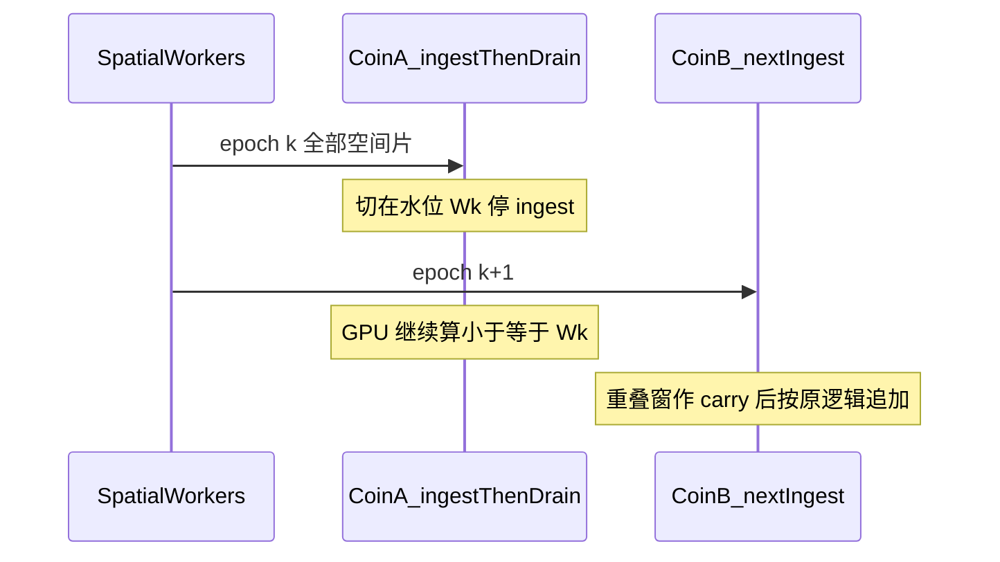
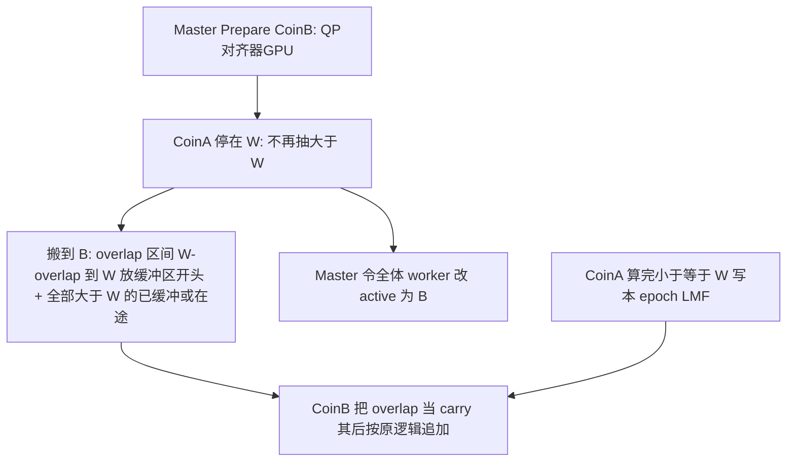

# 符合计算时间分片总体设计

本文只定架构与契约，不描述尚未落地的 proto / 代码。单符合节点内的水位线、carry、多 GPU 流水线仍以 [STREAMING_COINCIDENCE.md](STREAMING_COINCIDENCE.md) 为准。本文是在「整台符合机」这一级再套一层 **epoch / 租约**。

## 1. 问题与约束

当前拓扑已完成 **按探测器几何的空间分片**（R2S `channelIndices` → 多台 `app_acq_r2s_node`），**未完成按时间分片**：所有空间片仍汇入 **一台** `app_coin_master` 做水位线对齐与 GPU 符合。

符合不能按空间再拆：一对符合可能来自任意两个探测器，任一时间窗内必须在 **同一符合进程** 看到全部空间片。因此水平扩展只剩时间轴。

实时流还有一个硬事实：**当前到达的 singles 都挤在同一 PET 时间前沿**。不能把「现在这一秒」拆给两台符合机各算一半而不加延迟缓冲。时间分片在实时路径上是 **ingest 串行、compute 流水**：



- **能提高的**：切片 k 的 GPU 与切片 k+1 的收包重叠 → 吞吐接近 `min(单机 NIC, 各符合机 GPU 之和)`（切片够长、交接够便宜时）。
- **不能单独解决的**：单机 NIC 已吃满 60 Gib/s。时间片不会把同一时刻的流量拆到两块网卡；那种情况要加交换结构或接受延迟后做离线平行切片，不在本阶段。

单机内已有的水位线、carry、`maxSegmentSingles`、`bufferHighWaterRatio` **保持不变**。切点复用同一套 `calculateWatermark()`，保证分布式与单机逐段 `processSegment` 等效。

## 2. 角色

扩展后仍选 **一个节点做主控**。采集控制面（`acquisitionControl`）与符合主控分离，本设计不把它拉回来。

| 角色 | 进程 | 职责 |
|------|------|------|
| Master | 现有 `app_coin_master`（Coin-0） | 注册、OpenDataPlane 编排、Start、心跳、**时间租约状态机**、选下一跳、监督交接。本阶段仍可同时当一台符合计算节点。 |
| Coin worker | 新角色或同一二进制不同配置（Coin-1..K） | 与今日单机相同的 RDMA 收包 + `StreamingTimeAligner` + GPU + 本机 LMF。只消费 **当前租约** 内的数据。 |
| Spatial worker | 现有 `app_acq_r2s_node` | 几何分片不变。控制面只连 Master；数据面 **预建到所有 Coin 的 QP**，任一时刻只向 **active ingest coin** WRITE。 |

K=1 时时间分片层为空操作，行为与今日单机兼容。

## 3. 时间分片策略

### 3.1 其他领域可对标的做法

| 领域 | 机制 | 可借用 |
|------|------|--------|
| Apache Flink / Google Dataflow | 事件时间水位线、滚动窗、allowed lateness、rescale 前 savepoint | 切点必须是 **PET 事件时间** 而非墙钟；重叠窗 = lateness/滑动余量；交接前把窗口状态（carry）带走 |
| 射电相关器（ALMA / SKA dump） | 固定时长 time dump，相关岛按时间片接力 | 仪器级「时间片」；片长按积分时间与后端容量定，而不是按瞬时队列抖 |
| 蜂窝 make-before-break 切换 | 先准备目标小区，再切用户面，源侧排空 | 先建 QP/对齐器，再切 active；源节点 drain，禁止 break-before-make |
| HLS/DASH | 固定时长媒体段 + discontinuity / PDT | 每个 epoch 一份可独立落盘的 LMF，靠时间戳拼接 |
| 链复制 / 主备切主 | 在日志切点把 suffix 交给新主 | 「水位之后 + 重叠前缀」整段搬到下一节点 |
| HEP TDAQ（lumiblock） | 以时间块为重建/滤波农场的分区键 | `epochId` 作为下游重建的分区，而不是靠文件到达序 |

**只按缓冲余量切换** 更接近负载熔断，适合突发；单独使用会切点抖动、LMF 边界难预测、频繁交接（重叠窗反复搬）。

**只按固定时间片切换** 更接近 Flink 滚动窗 / correlator dump，适合容量规划与下游排序；单独使用会在注射峰值丢数、空白扫描空转。

本系统单机路径里已经是混合：水位线管正确性，`minSegmentSingles` 攒批，`bufferHighWaterRatio` / `maxProcessLatencyMs` 管实时。时间分片把同一套语义抬到整机租约。

### 3.2 推荐：事件时间租约 + 高压抢占

```text
TimeLease {
  epochId,              // 全局单调
  coinId,               // ingest + 本片符合
  t0, t1,               // PET 时间，单位与 timevalue_100fs 一致；t1 初始可为 +inf
  overlap_100fs,        // 已有 overlapLength = (timeWindow+delayTime)*10
  minLease_100fs,       // 防抖：短于此时长禁止因高压切换
  reason                // PlannedT1 | HighWater | ScanEnd | Manual
}
```

- **计划切点（主路径）**：按仪器预期峰值与单机可持续符合速率估算片长。目标是「上一片 GPU 排空时间 ≈ 下一片收包时间」，让多卡流水能叠上。下界远大于重叠窗（沿用 `minSegmentOverlapFactor` 的思想，租约以秒～数十秒计，而不是微秒段）。上界受单机环深/内存能扛住的突发限制。
- **高压抢占（辅路径）**：任一台空间片对应的 ring / 内存池 / RDMA credit 触及高水位，**且** 已过 `minLease`，**且** 下一 Coin 已 Prepare 成功 → Master 把 `t1` 收到 **当前可切的水位线**（不是墙钟 now）。这是现有 `bufferHighWaterRatio` 的整机版：动作从「本机提前 processSegment」升级为「交 ingest」。
- **禁止**：用主机墙钟切片；未到齐就为了切换越过水位线；租约短于重叠窗；在下一节点未就绪时抢占。

容量规划：先用单机 `--extract-only` / `--merge-pinned` 与带核 soak 得到「单机可持续 singles/s」。输入长期高于该值才需要第二台符合机做流水；若单机 GPU 已够、只是偶发突发，高压抢占 + 单机背压往往够用。

与单机参数的关系：

| 单机参数 | 时间分片上的对应 |
|----------|------------------|
| `calculateWatermark()` | 租约切点 `W = t1`，定义不变 |
| `overlapLength_100fs` | 跨机 carry 长度，与段内 carry 相同 |
| `minSegmentOverlapFactor` | 租约 `minLease` 的下界思想来源；租约本身以秒级计 |
| `bufferHighWaterRatio` | 高压抢占的触发，动作从切段升级为交 ingest |
| `maxSegmentSingles` | 仍约束每台 Coin 送入内核的单批，不因两机交接而加倍 |
| `maxProcessLatencyMs` | 仍只在 **当前 ingest Coin 机内** 触发切段；租约决策只在 Master |

## 4. 交接与数据同步（与单机等效）

切点 **必须是一次真正的水位线划分** `W = t1`，与今日 `calculateWatermark()` 同定义（全空间片 `min(maxEventTime) − safetyMargin`）。不允许在未到齐的节点上「先切再说」。



**Make-before-break 是唯一交接模式。**

1. **Prepare**：Master 让 Coin-B 对所有已注册空间节点 `OpenDataPlane`（或沿用启动时已建好的 QP）。对齐器空转，GPU 就绪。Worker 侧 `CoincidenceClient` 保持 **多目的地会话**，仅切换 `activeCoinId`。
2. **Cut**：Coin-A 将本租约上界钉在 `W`。内部仍按现逻辑把 `≤ W` 算完（段内 carry 不变）。**最后一次** 抽出 `[W − overlap, W]` 作为 **跨机 carry**，不在 A 上当作「下一段」继续用。
3. **Ship**：把该 overlap **按空间 nodeId 分开放在 B 各 ring 的开头**（或一条带 nodeId 的交接流，B ingest 时拆回 per-node ring）。再把 A 上 **已收但 `minTime > W`** 的 chunk、以及 Cut 之后误打到 A 的在途槽，原样转给 B。B 从水位 `W` 起追加，后续 `calculateWatermark` 与今日相同。
4. **Redirect**：Worker 对 **新生产的槽** 改 WRITE 到 B。跨 `W` 的半块在 worker 或 A 上按时间切开（与现半块 `consumed` 相同），`≤ W` 留 A，`> W` 去 B。
5. **Drain-A**：A 只消化 `≤ W`，写完本 epoch 的 prompt/delay，报 `EpochComplete`。B 在 overlap 就位前不得对 `> W` 做符合（缺 carry 会丢跨切对）。

### 等效性不变量

后续正确性测试应按下列契约写，而不是比文件到达序：

1. 全局事件集合按 PET 时间分成半开区间 `… [t0, W) ∪ [W, t1) …`（与现 `upper_bound` 对齐：切点时刻归下一 epoch）。
2. 跨 `W` 的 prompt/delay 对只在 **B** 上出现一次：overlap 在 B 的角色 = 今日 `m_carrySingles`，`carryCutoff = W`。
3. A 不得再匹配 `> W`；B 不得把 overlap 内部再配对（现成 `carryCutoff`）。
4. 多机串起来的结果 = 单机从 t0 跑到结束（允许已知的 prompt-cutoff 契约偏差，与 Test 9a 一致）。

交接通道：控制面 gRPC 下发租约；**重叠窗 + 尾包走数据面**（Coin-A→Coin-B 的 RDMA/专用 QP）。控制面只适合很小的元数据。Overlap 在 60 Gib/s 下约 2 μs × 全空间片，大约千量级 singles/片源；尾包可能很大，必须走数据面。

失败：Prepare 失败则续租在 A 并告警；Ship 失败视为本 epoch 故障（停 ingest / 背压上游），不默认丢 overlap（否则与单机不等价）。

## 5. Listmode 全局时间与下游顺序

现状：内存 `Listmode` 已有 `time1_2_100fs` 与 `timestamp_100us`（符合时刻，100 μs 量化）；流式写盘 `AppendSegment(..., 0, 0)`，文件头也未打开 `absolute_timestamp*_100fs`。多 epoch、多机之后 **文件到达序 ≠ PET 时间序**（A 的尾与 B 的头会交错落盘）。

契约：

1. **事件时间（排序键）**：每个 pair 写入 **符合 PET 时间**。优先在 LMF 打开与 singles 一致的高精度字段（或明确 `timestamp_100us` + 分片内序）；禁止只用主机时钟。现内核已有 `coincidenceTime100fs = min(t_left, t_right)`，应落到文件而不是丢掉。
2. **分片元数据（归并键）**：每个输出文件（或 Unimode segment header）带 `epochId, coinId, t0, t1, W, overlap`。命名示例：`prompt_epoch{E}_coin{id}_{t0}_{t1}.lmf`。
3. **下游**：按 `(符合PET时间, epochId, 文件内下标)` 做 k-way merge；同一时间戳用 epoch + 稳定下标打破平局。重建侧把各 coin 的目录当时间分区，不必在写入时做全局锁排序。
4. **不在热路径做跨机合并写**：各 coin 本地写，避免交接时抢同一文件。

`timestamp_100us` 约 100 μs 粒度，临床重建通常够；若 TOF / 列表模式分析要亚 ns 对齐，应启用 100fs 绝对时间字段。两者都要有 `epochId`，避免量化碰撞。

## 6. 控制面状态

现有：WaitRegister → WaitDataplane → Ready → Running → Draining → Stopped。编排细节见 [状态机与调试.md](app以及实验配置/状态机与调试.md)。

Running 内增加 epoch 子状态：`LeaseActive` → `PrepareNext` → `Cutting` → `Shipping` → `Redirected` → `DrainPrev`。Worker 心跳继续只打 Master；Master 把 `ProducerCommand` 扩展为 `SET_ACTIVE_COIN`（或等价），不要让 worker 自己选下一跳。

启动：全部空间节点注册后，Master 让 **所有 Coin** 与全部 worker 建 QP（make-before-break 的准备提前到 Start），第一个租约给 Coin-0。

## 7. 时钟域与 timesync 边界

**符合计算与时间分片切点不需要符合节点之间做 μs/ns 级主机时钟同步。** 对齐域只有 PET 时钟板；主机时钟最多做运维级（毫秒～十毫秒）松同步。

### 7.1 两套时钟，不要混用

| 时钟域 | 来源 | 用途 | 精度需求 |
|--------|------|------|----------|
| **PET 事件时间** | 探测器/时钟板 → `Single.timevalue_100fs` | 水位线、租约 `[t0,t1)`、carry 重叠、符合配对、LMF 排序键 | 已由仪器保证，全空间片共用同一板，节点间可直接比较 |
| **主机墙钟 / 单调钟** | OS `system_clock` / `steady_clock` | 心跳超时、Prepare/Cut 的 RPC 因果序、日志、槽头 `computerClock_ms` | 毫秒级即可；**不得**当切点 |

[STREAMING_COINCIDENCE.md](STREAMING_COINCIDENCE.md) 已写明：对齐以 PET 时间为准，`computerClock_ms` 只是粗参考；`networkLatencyMargin` 也是 PET 时间裕量，不是墙钟等包。时间分片只是把同一水位线抬到整机租约，**不引入新的时间基准**。

切点 `W` 由 **当时 ingest 的那台 Coin** 按现算法算出，经 Master RPC 告诉全体 worker 与下一跳。这是 **因果交接**（消息带着 PET 时间 `W`），不是「大家墙上钟走到某一刻一起切」。Coin-B 不需要和 Coin-A 对齐主机时钟才能理解 `W`。

高压抢占看的是 **缓冲占用 / credit**，不是「谁的 now() 更大」。`minLease` 用 PET 跨度，避免用各机本地墙钟各算各的。

### 7.2 什么时候才需要主机同步

- **正确性（符合、切分、LMF 归并）**：不需要。
- **运维**：多机日志对齐、心跳超时解释、槽头 `computerClock_ms` 对照 —— NTP/chrony 到约 1–10 ms 足够。
- **不要**为了时间分片上 PTP / 原子钟；那是采集前端在没有 PET 板时才需要的量级。

若错误地用墙钟切片，主机偏差会直接造成切点错位或重复/漏 overlap；这是禁止墙钟切片的原因，不是「先把主机钟校到 ns」能补上的。

### 7.3 与 `include/grpcService/timesync` 的关系

该模块是 Cristian/NTP 风格的 **主机时钟偏置估计**（gRPC `SyncClock` 交换本地 ns），文档标称小于 100 μs，目标原是采集节点用主机时间打事件戳时的事后校正（`ClockCalibrationUtil::CalibrateEventTime`）。现行 app **未接线**，见 [测试/单元模块.md](测试/单元模块.md) 与 [README_CLOCK_SYNC.md](README_CLOCK_SYNC.md)。

接入原则：

1. **禁止**把 `clock_offset_ns` 加到 `timevalue_100fs`、水位、carry、租约 `t0/t1` 上。PET 时间已经全局可比；再叠一层主机偏置会破坏与单机等效。
2. **符合热路径不依赖** `TimeSyncClient::GetCorrectedTimeNs()`。`StreamingTimeAligner` / GPU 符合保持只读 PET 字段。
3. **可选运维面**：Master（Coin-0）兼 `TimeSyncService`；Coin worker 与 spatial worker 作 client，只校准 **日志 / 心跳 / `computerClock_ms`**。控制面超时仍以 Master 单点计时为准，避免各节点用各自校正钟做租约决策。
4. **不要**把 `TimeSyncClient.hpp` 里现在的 `PerformSync()` 直接当生产实现：它在本地用 `GetMonotonicTimeNs()` 自比，没有真正打 gRPC。跨机应走已有 `TimeSyncServiceImpl`。
5. **若接线运维面**：跨机比较必须用可互相对齐的钟（`system_clock` 或 PTP 授时后的 CLOCK_REALTIME）。`steady_clock` / `GetMonotonicTimeNs()` **不能**在两台机器之间减出有意义的 offset。Client 侧应调用真实 `SyncClock`（T1/T2/T3/T4）。`ClockCalibrationUtil` 仅用于「确实用主机时间打戳的遗留段」；50100 流式路径不走它。

历史「无 PET 板、事件戳来自各采集机墙钟」才是 timesync 的主战场，与本时间分片正交。即使将来接线，也是 **spatial worker 采集侧**，不是 coin 之间为了切片去严格对时。本阶段 timesync 保持未接线。

## 8. 本阶段明确不做

- 按空间拆符合，或让两台 coin 同时 ingest 同一时间前沿（除非另做「延迟后打散」的离线模式）。
- 用墙钟 / 单纯 CPU 占用切片。
- 用 timesync 偏置改写 PET 事件时间，或让符合切点依赖主机时钟同步。
- 交接时丢掉重叠窗，或让 B 在 carry 未到时开算。
- 把 listmode 实时汇到单一全局文件。
- 用 timesync 改写 `timevalue_100fs` 或把墙钟当切点（仍见 §7）。

## 9. 实现与单机测试

落地是在现有水位 / carry / GPU 流水线上加 **epoch 租约层**。切点必须是水位线 `W`：`completeEpoch(W)` 只处理 `≤ W`，overlap `[W−overlap, W]` 作下一跳 carry，`> W` 的半块/整块进 `EpochHandoff.tail`。K=1（不填 destinations、不调 `completeEpoch`）时 `stop()` 仍全量 `flushRemaining`。

| 阶段 | 代码 | 单机门禁 |
|------|------|----------|
| P1 aligner | `StreamingTimeAligner::completeEpoch` / `takeHandoff` / `applyHandoff`；`shipEpochHandoff` | [`test_coin_time_shard`](../tests/correctness/test_coin_time_shard.cpp)：9120 `.lsingle` 双实例对照 `getDListmode(cutoff=0)`；delay 全等；prompt ≤ 金标准 + 两段 `carrySinglesTotal`（Test 9a） |
| P2 LMF | 文件前缀 `prompt_epoch{E}_coin{id}_{t0}_{t1}`；`AppendSegment` clockMs = `epochId`；打开 `coincidence_timestamp_100us` | 同上：按 `(符合PET时间, epochId, 下标)` 归并后再比条数 |
| P3 控制面 | proto `CMD_SET_ACTIVE_COIN`；heartbeat `active_coin_id`；`CoincidenceClient` 多 session；compute `RegisterCoin` | `test_rdma_orchestration` 冷切（只证 QP/命令）与热切（节点自有 ship QP） |
| P4 租约 | Master `TimeLease`：`LeaseActive → PrepareNext → Cutting → Shipping → Redirected → DrainPrev`；计划 PET `t1` + 环高水位抢占；Running 循环 `tickLease` | `time_lease_fsm`：未 Prepare 续租在 A；只切一次。`time_lease_tick_production_ship`：Prepare→Cut→Ship→Redirect |
| P5 Ship | `OpenShipPlane` + 专用 `RdmaRecvServer`（与 worker ingest 隔离）；`shipEpochTo` 走 RDMA + `WaitForShipApplied` 后再 `SET_ACTIVE_COIN` | 加大 payload 的 `epoch_ship_inprocess`；双 `CoinGrpcNode` 生产 ship QP；无 RNIC 则 skip 两进程 RoCE |

无 9120 数据时 `test_coin_time_shard` skip（退出 0）。K=1 的 app JSON 不填 destinations，行为与现 `rdma_cluster/*.json` 相同。跨进程 app 冒烟仍是 [`test_app_inprocess_smoke`](测试/集成.md#test_app_inprocess_smoke)。
