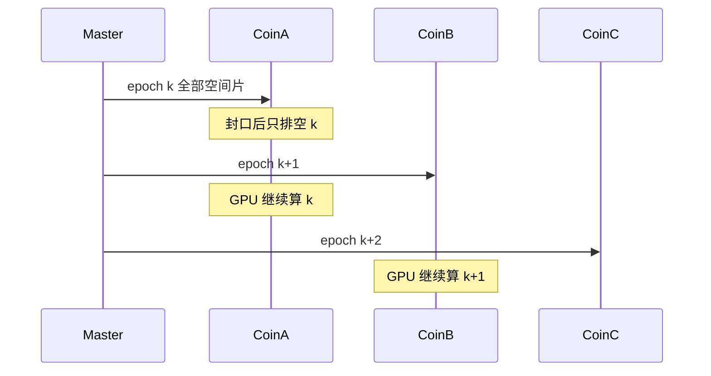

# 符合计算时间分片的理论说明

本文说明时间分片在文献里对应哪一类模型，以及片长和符合计算节点数该怎么从这些模型里读出来。架构契约、交接步骤和测试仍以 [TIME_SHARD_COINCIDENCE.md](TIME_SHARD_COINCIDENCE.md) 为准；单机水位线、carry 与段参数以 [STREAMING_COINCIDENCE.md](STREAMING_COINCIDENCE.md) 为准。

三节的边界如下：

1. **重叠时间窗**是每台符合机内部的正确性。它决定跨切点要搬走的 carry 有多宽，不决定几台服务器、多久轮换一次。
2. **分布式时间分片**是多台符合计算服务器之间的调度：一个 PET 时间片整片分给一台机器，ingest 角色按片轮转。
3. **片长与节点数**把第 2 节的启动间隔落到 `plannedLeaseSpan_100fs`、`minLease_100fs` 和符合机台数 \(K\)。

## 1. 节点内部的重叠窗

符合是同一条 singles 流上的区间自连接：每个能量合格的事例打开一个固定时间窗，窗内的其他事例与之配对。多窗（multiple window）让每个事例都开窗；「接受所有合法对」（take-all-goods）是现代全身 PET 的常见策略。GATE 符合排序器在多窗下的缓冲行为见 Strydhorst 与 Buvat 对 sorter 的改写 [1]。

把 list-mode 按时间切成多段并行时，段与段之间如果是硬边界，跨边界的一对会被丢掉。Goldschmidt 等的软件符合处理已指出这一点 [2]。EXPLORER 全身 PET 的软件符合器把相邻段的缓冲做大，使段尾与下一段段头重叠，并且每个参考事例只打开一次主时间窗，从而去掉硬边界 [3]。重叠的是**处理缓冲**，时间轴上的事件仍然只归一段。

流处理里的对应表述有三条，它们约束的都是「一台机器上的窗口状态能丢到哪里」：

- 滚动窗（tumbling window）把事件时间切成互不重叠、无间隙的半开区间 \([N L,\ (N+1)L)\)。每个事件只属于一个窗 [4]。符合配对本身是滑动的区间连接；滚动窗只负责给事件发「属于哪一片」的标签。
- 区间连接要保留旧元组，直到时间差超过窗宽加最大迟到。BiStream 的表述是：窗宽 \(\varpi\)、最大网络延迟 \(D\) 时，仅当新元组与旧元组的时间差 \(> \varpi + D\)，旧元组才能从内存丢掉 [5]。Kafka `JoinWindows` 用的是同一个谓词：两端时间戳之差不超过给定的 `timeDifference`。
- 封口必须落在事件时间水位线之后。水位线等于「已观测到的事件时间减去有界迟到」；水位线之前的数据才视为到齐 [6]。

本系统把这三条收成两个已有的量，二者都在单机对齐器里，时间分片只是原样拿到整机租约上：

```text
overlapLength_100fs = (timeWindow_ps + delayTime_ps) * 10

getTotalSafetyMargin = networkLatencyMargin_pico * 10
                     + max(timeWindow_ps, delayTime_ps) * 10
W = min_n(maxEventTime_n) - safetyMargin
```

`timeWindow_ps` 与 `delayTime_ps` 的默认值是 2 ns 与 2 µs，重叠带约 **2.002 µs** PET 时间（时间戳单位是 100 fs，皮秒配置值乘 10）。这个宽度要同时盖住 prompt 窗和 delay 窗，再短会漏掉跨切点的对。`networkLatencyMargin_pico` 默认 0；符合窗那一项保留。切点时刻按 `upper_bound` 归下一片，与半开区间 \([t_0, W)\) 一致。下一台机器上的 overlap 扮演本机 `m_carrySingles`，`carryCutoff = W`，使参考事例只在一片上开窗。这就是 EXPLORER 重叠缓冲和 BiStream 保留时间在本系统里的落点。

因此重叠窗给片长的约束只是一条数量级：计划片长 \(L\) 远大于 overlap。1 s 的片相对 2 µs 的重叠，交接数据约占片长的 \(2\times 10^{-6}\)。片长本身以秒计，见第 3 节。

按探测器对把符合拆开（每个探测器对一个选择器）是另一条空间并行路线 [7]。本系统的一对符合可以来自任意两个空间片，同一 PET 时间前沿必须进入同一个符合进程。扩展因此沿时间片轮转进行，见第 2 节。

## 2. 分布式时间分片：划分与轮转

### 2.1 要调度的问题

设有 \(K\) 台相同的符合服务器。空间分片已经由采集侧完成，符合侧不再按几何拆。实时到达的 singles 挤在同一条 PET 时间前沿上，任一时刻全部空间片只写入 **一台** active ingest。一个 epoch 是 PET 时间上的半开区间 \([t_0, W)\)，整片分给这台机器。封口之后，这台机器只排空本片；Master 把 ingest 角色转到下一台。其余机器各自排空已经接过的 epoch。下一跳由 Master 选择，空间 worker 不自行挑符合机。



\(K = 1\) 时没有轮转，行为与单机相同。

### 2.2 有状态算子的迭代流水

一个 epoch 之内，符合算子必须看见该片上的全部空间片，同一次迭代不能再裂到多台机器。流程序（StreamIt）对这类算子的划分是：无状态 filter 可以复制到多个核上做数据并行；有状态 filter 的同一次迭代留在一处，并行来自把**不同迭代**放到不同核上，也就是软件流水 [8]。这里一次迭代就是一个 epoch，一台符合机就是流水上的一个槽位。

新迭代多久能启动，由模调度（modulo scheduling）给出：启动间隔 \(II\) 不小于资源约束，也不小于跨迭代依赖的延迟 [9]。对本系统三条约束同时成立：

- 活的时间前沿只有一个接收端。当前片收完、角色转走之后，下一片才开始被下一台接收，因此 \(II \ge T_{\mathrm{ingest}}\)。
- 跨片依赖是一次交接：下一台 Prepare 完成，重叠带与切点之后的尾部 Ship 到位，空间 worker 的写入目标 Redirect 到下一台。因此 \(II \ge T_{\mathrm{handoff}}\)。第 1 节的重叠窗是这条依赖边上携带的数据，宽度已由符合协议固定，不决定 \(II\) 的主项。
- 每台机器每 \(K\) 片才再次成为 ingest。设一片的计算时间为 \(T_c\)，\(K\) 个槽位分摊计算，则 \(II \ge T_c / K\)。

合起来：

```text
II ≥ max(T_ingest, T_handoff, T_c / K)
```

实时采集里 PET 时间与墙钟大约 1:1，一片的墙钟时长 \(T \approx L\)。要跟上束流，需要 \(II \le L\)。

轮转就是模调度的槽位分配：

```text
epoch k  →  coin (k mod K)
```

\(K = 2\) 时是双缓冲：一台接收当前片，另一台排空上一片。\(K > 2\) 是同一环上的多缓冲，用来掩盖 \(T_c > L\) 时一台机器来不及在下一轮之前排空。

交接顺序沿用 make-before-break：下一台的数据面与对齐器先就绪，再切 active，源侧继续排空已封口的片。Prepare 未完成时续租在当前机器上，避免在空槽位上启动下一次迭代。

### 2.3 微批间隔，以及间隔如何随负载变化

离散流（D-Streams）把无限输入收成固定间隔的微批，每一批是一个不可变数据集，相邻时间步可以流水重叠：下一步的 map 与上一步的 reduce 同时进行 [10]。可借用的是两件事：用批间隔把流切成可调度的时间片，以及让相邻片的计算重叠。D-Streams 在一批之内还会按分区做数据并行；本系统一个 epoch 整片只进入一台符合机，批内再拆的那一半留在他们的模型里。

批间隔跟随负载的经典做法，是在同一集群里把批长调到处理时间附近，使调度开销与排队延迟一起稳定下来 [11]。`plannedLeaseSpan_100fs` 是同一类目标间隔：按单机可持续速率事先定一个片长，使上一片的排空与下一片的接收同量级。

高压抢占是运行中的另一动作，触发条件同时满足三条：当前 ingest 机的环或内存占用达到 `bufferHighWaterRatio`（默认 0.80）、本片 PET 跨度已超过 `minLease_100fs`、下一台已经 Prepare 成功。此时 Master 把本片上界 \(t_1\) 收到**当前可切的水位线**，提前轮转。动作是把活的前沿交给环上下一台空闲机器。计划片长仍是主路径；高水位只在缓冲装不下计划片长时把本片收短。

### 2.4 同样沿时间轴切段、调度方式不同的系统

下面三种系统也把时间或工作切成块再分给多台机器。它们回答的调度问题与第 2.1 节不同，片长经验可以对照，分配规则不直接搬用。

**直播切片转码。** HLS/DASH 把直播切成固定时长的媒体段，常见长度为数秒到十秒，用来摊薄每个任务的调度开销，段与段靠时间戳拼回连续节目。工人从队列领取的是已经封口、写进共享存储的段，空闲工人可以领取任意一段。本系统的开放 epoch 经 RDMA 直接进入当前 active coin，状态留在该机上排空；轮转的对象是 ingest 角色。若先把整片落到共享存储再平行分发，延迟至少多出一整片，那是架构文档里单独列出的离线路径。

**ATLAS 高能触发农场。** 事例彼此独立，农场按事例把工作派到有空核的节点。Run 1 的硬件 RoI 分发按固定 round-robin 把事例分给多个 Level-2 监督者，负载要靠配置拉平；Run 2 收成单一 HLT supervisor，按全农场的空闲情况派发 [12]。Lumiblock 是取数期间约一到两分钟的稳定时间块，作为下游重建的分区标签随事例携带。它标记「这段数据属于哪一个时间块」，不决定哪一台机器接收当前束流。本系统的 Master 同样是单一调度者；分配键是 epoch，每一片包含该 PET 区间内的全部空间片。

**Flink 的 round-robin 状态重划分。** 无 key 的算子状态在并行度变化时，按 round-robin 把状态条目拆给新的并行实例，发生在从一次一致快照恢复、作业按新并行度重启的时候 [13]。本系统的轮转发生在运行过程中：每个新 epoch 换一台 ingest，同一片的状态留在接收它的那台机器上，直到该片排空。

## 3. 片长、轮转周期与加节点

符号如下。这些量需要在目标机器上测量，本文不给出未测的 singles/s。

| 符号 | 含义 |
|------|------|
| \(R\) | 输入 singles 速率 |
| \(C\) | 一台符合机的可持续处理速率 |
| \(L\) | 计划片长，PET 时间，对应 `plannedLeaseSpan_100fs` |
| \(T\) | 这一片的墙钟时长。实时且 PET 钟与墙钟 1:1 时 \(T \approx L\) |
| \(T_c\) | 一片的计算时间，\(T_c = (R / C)\, L\) |
| \(T_{\mathrm{handoff}}\) | Prepare、Ship 与 Redirect 的墙钟时间 |
| \(K\) | 轮转环上的符合机台数，含 Master 自己充当的那一台 |

时间单位换算：事件时间与租约字段都是 100 fs。1 s PET 时间 = \(10^{13}\) 个 100 fs 单位。

### 3.1 片长

片长的下界来自启动间隔，重叠窗只贡献其中极小的一项。

- \(L\) 远大于 overlap（第 1 节，默认约 2 µs）。秒级片上，重叠数据相对片长约为 \(10^{-6}\)。
- \(T_{\mathrm{handoff}} \ll L\)。交接占满 \(II\) 时，环上的机器把时间花在轮转上，计算槽位叠不起来。
- `minLease_100fs` 是高压路径的防抖下界：占用到了高水位，PET 跨度仍短于 `minLease` 时不切。它避免计划片长被抢占切到短于交接能够摊薄的程度。

片长的上界是当前 ingest 机的 ring 与内存。封口之前，这一片留在该机上。高水位提前轮转把上界从计划的 \(L\) 收成「缓冲还装得下的那条水位线」。`maxSegmentSingles` 仍只约束送进单机符合内核的一批，不因为多机交接而加倍。

计划片长的目标，是让上一片 GPU 排空与下一片收包处在同一量级，使第 2.2 节的流水叠得上。它由单机可持续速率标定（提取路径与带符合核的浸泡各测一次 \(C\)），不从符合窗宽推出来。窗宽只固定 overlap。

### 3.2 节点数

\(K\) 是环上同时在飞的 epoch 槽位数，也是轮转周期：一台机器处理完 epoch \(k\) 之后，下一次轮到它的是 epoch \(k+K\)。

机内水位线在摄入期间已经切段计算时，这台机器的 GPU 从本片一开始就在工作，交棒之后继续排空剩余部分，直到再次成为 ingest。一个周期 \(K\) 片的墙钟都算在这台机器的计算预算里：

```text
T_c / K ≤ L    ⇒    K ≥ R / C
```

同时仍要 \(T_{\mathrm{handoff}} \le L\)。这是本系统的主界：单机对齐器在收包过程中按水位线处理，符合第 2.2 节里 \(II \ge T_c / K\) 的那一支。

若一片必须等封口之后才开始计算，摄入那一段时间不能记入本片的 GPU 预算，排空窗口只剩另外 \(K-1\) 片：

```text
T_c ≤ (K - 1) L    ⇒    K ≥ 1 + R / C
```

\(R \le C\) 时第一式给出 \(K = 1\)。此时再加第二台只增加一次交接，吞吐仍由单机 \(C\) 决定。\(R > C\) 时按上式增加被控符合节点，分配保持 `epoch k → coin (k mod K)`。Master 维护租约并选择下一跳；每台机器交棒后排空自己的片，直到轮转再次转到它。

### 3.3 瓶颈

加符合机增加的是轮转环的深度。活的时间前沿仍然只有一个接收端，同一秒的流量进同一台机器的网卡。单台接收带宽已经吃满时，吞吐停在这条摄入路径上；继续加大 \(K\) 不提高摄入速率。要拆开同一前沿，需要改变交换结构，或接受至少一整片的额外延迟后再做离线平行切片。

水位线取各空间片最大事件时间的最小值。最慢的空间片会把 \(W\) 按住，轮转要等这一水位线到达计划切点或高水位切点。增加符合机不推进这个最小值。

高压抢占看的是缓冲占用，触发后切点仍是 PET 水位线。主机墙钟不参与切片。

### 3.4 理想情况下如何增加符合节点

1. 在单台上测 \(C\)：提取路径与带符合核各一次，确认瓶颈在 GPU 还是在接收。
2. \(R \le C\) 时保持 \(K = 1\)。
3. GPU 是瓶颈且 \(R > C\) 时，按第 3.2 节的主界取 \(K = \lceil R / C \rceil\)，增加 `app_coin_node`。若实测表明封口之后才有 GPU 时间，改用 \(K = \lceil 1 + R / C \rceil\)。
4. 片长取在交接可忽略、且单片 singles \(R L\) 装得进该机 ring 的区间内。运行时以计划切点为主；占用达到 0.80、已过 `minLease`、下一台已 Prepare 时提前轮转。
5. 接收带宽先于 GPU 吃满时，停止加符合机，改为提高单台摄入路径的带宽。

## 参考文献

1. J. Strydhorst, I. Buvat. Redesign of the GATE PET coincidence sorter. *Phys. Med. Biol.* 61 (2016) N522.
2. B. Goldschmidt et al. Towards software-based real-time singles and coincidence processing of digital PET detector raw data. *IEEE Trans. Nucl. Sci.*, 2013. doi:10.1109/TNS.2013.2252193.
3. E. K. Leung, M. S. Judenhofer, S. R. Cherry, R. D. Badawi. Performance assessment of a software-based coincidence processor for the EXPLORER total-body PET scanner. *Phys. Med. Biol.* 63 (2018) 18NT01.
4. J. Verwiebe, P. M. Grulich, J. Traub, V. Markl. Survey of window types for aggregation in stream processing systems. *The VLDB Journal* 32 (2023). doi:10.1007/s00778-022-00778-6.
5. Q. Lin, B. C. Ooi, Z. Wang, C. Yu. Scalable distributed stream join processing. In *SIGMOD*, 2015. （BiStream；丢弃条件为时间差 \(> \varpi + D\)。）
6. T. Akidau et al. The dataflow model: a practical approach to balancing correctness, latency, and cost in massive-scale, unbounded, out-of-order data processing. *Proc. VLDB Endow.* 8(12), 2015.
7. X. Cheng, K. Hu, D. Yang, Y. Shao. FPGA-based distributed coincidence processor for high count-rate online PET coincidence data acquisition. *Phys. Med. Biol.* 66 (2021) 055009.
8. M. I. Gordon, W. Thies, S. Amarasinghe. Exploiting coarse-grained task, data, and pipeline parallelism in stream programs. In *ASPLOS*, 2006.
9. B. R. Rau. Iterative modulo scheduling: an algorithm for software pipelining loops. In *MICRO-27*, 1994.
10. M. Zaharia et al. Discretized streams: fault-tolerant streaming computation at scale. In *SOSP*, 2013.
11. T. Das, Y. Zhong, I. Stoica, S. Shenker. Adaptive stream processing using dynamic batch sizing. In *SOCC*, 2014.
12. ATLAS Collaboration. The ATLAS data acquisition and high level trigger system. *JINST* 11 (2016) P06008.
13. P. Carbone, S. Ewen, G. Fóra, S. Haridi, S. Richter, K. Tzoumas. State management in Apache Flink. *Proc. VLDB Endow.* 10(12), 2017.
