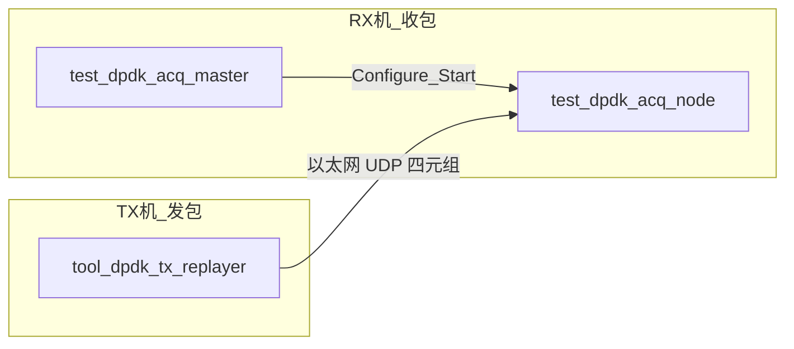

# DPDK 采集配置与使用（基于 PNI）

本文档面向当前 `pni_r2c` 项目，补充“如何在本项目中启用并使用 DPDK 采集”。

参考来源：
- PNI 文档：`pni-standard-project/docs/项目介绍/DPDK支持.md`
- 本项目采集控制与 app 配置文档

## 1. 适用范围与前置假设

1. 操作系统：Linux。
2. 假设 DPDK 已安装（如未安装，先按 PNI 文档完成安装与基础验证）。
3. 本文重点是“本项目如何接入 DPDK 采集路径”。
4. 若pni-core中的DPDK未启用，请确认DPDK已安装，并重新编译安装pni

## 2. 先判断机器是否具备 DPDK 运行条件

建议先做四类检查。

### 2.1 安装层检查

```bash
command -v dpdk-testpmd
command -v dpdk-devbind.py
command -v dpdk-hugepages.py
pkg-config --modversion libdpdk
```

判定：
1. 三个工具都可执行。
2. `libdpdk` 可返回版本号。

### 2.2 运行层检查（EAL 能否初始化）

```bash
dpdk-testpmd --no-pci --no-huge -- --total-num-mbufs=2048 --nb-cores=1
```

判定：
1. 输出中有 `EAL: Detected ...`。
2. 无动态链接或 EAL 初始化错误。

### 2.3 网卡绑定状态检查

```bash
dpdk-devbind.py --status
```

判定：
1. 目标网卡不能长期停留在普通内核驱动（如 `r8169`、`ixgbe`、`i40e`）用于 DPDK 数据面。
2. 用于 DPDK 的端口应切到 `vfio-pci`（或受支持的 UIO 驱动）。

### 2.4 HugePages 与 IOMMU 检查

```bash
grep -E 'HugePages_Total|HugePages_Free|Hugepagesize' /proc/meminfo
dpdk-hugepages.py -s
lsmod | grep -E 'vfio|uio|igb_uio' || true
test -e /dev/vfio/vfio && echo "/dev/vfio/vfio exists" || echo "missing"
```

判定：
1. `HugePages_Total` 大于 0。
2. `vfio` 相关能力可用。

## 3. 本项目中 DPDK 采集链路的关键点

当前项目链路为：

1. `app_coin_master` 下发 `AcquisitionTask`。
2. `app_acq_r2s_node` 接收任务并创建采集 runtime。
3. 当 `algorithm_type=ALGORITHM_TYPE_DPDK` 且构建启用 DPDK 时，节点进入 `openpni::DPDKAcquisitionNew`（`InitDPDKNew`）。未开 DPDK 时仍走 Socket。旧 `DPDKAcquisition` 不再使用。

同时，DPDK 初始化参数来自任务中的 `dpdk_options`：

1. `bind_ips`（必填，数量须等于 DPDK 口数）
2. `rx_rings_per_port`（每口 RX/Copy worker 对数；`>1` 时 DPDKNew 打开 RSS）
3. `mbuf_pool_size` / `mbuf_cache_size`（0 表示用 libpni 默认）
4. `local_loopback_iface`（非空则 loopback vdev）
5. `extra_eal_args`（绑核、hugepage、`--file-prefix`）

以下旧字段仍可出现在 JSON/proto 中，**节点会忽略**：`copy_thread_num`、`rte_mbuf_double_pointer_size_multiply`、`rte_mbuf_double_pointer_num_multiply`。

采集池由 `MakeAcquisitionInfo` 设为 `CUDAHost`，R2S 应走 pinned 直拷。通路见 [采集到R2S](../接口说明/通路/采集到R2S.md)。

## 4. 配置步骤（项目视角）

## 4.1 网络与系统准备

1. 选择用于 DPDK 的网卡端口，并将业务 IP 与端口规划清楚。
2. 按 PNI 文档配置 HugePages。
3. 将目标网卡绑定到 `vfio-pci`。

示例（仅示意，按你的网卡 PCI 地址替换）：

```bash
sudo modprobe vfio-pci
sudo dpdk-devbind.py --status
sudo dpdk-devbind.py --bind=vfio-pci 0000:04:00.0
sudo dpdk-devbind.py --status
```

## 4.2 app 配置准备

在 `coin_master` 配置文件（如 `app/config/experiments/no_data_auto/coin_master_dpdk_nodata.auto.json`）中，至少配置：

1. `acquisitionControl.acquisitionAlgorithm`（`socket` 或 `dpdk`）
2. `acquisitionControl.dpdkRxRingsPerPort`
3. `acquisitionControl.dpdkBindIps`（`acquisitionAlgorithm=dpdk` 时必填）
4. 可选：`dpdkMbufPoolSize`、`dpdkMbufCacheSize`、`dpdkLocalLoopbackIface`、`dpdkExtraEalArgs`
5. `acquisitionControl.detectorSources[]`、`destinationIp`、端口规划
6. （推荐）`acquisitionControl.nodeOverrides[]` 做节点级覆盖
7. `timeSwitchBufferMs` 默认 **50**（建议 20–100）。200 Gib/s 时 200ms 一片会超过默认 4 GiB 池。
8. 200 Gib/s：每 100GbE 口建议 `dpdkRxRingsPerPort=4`（8 个 worker lcore），`extra_eal_args` 绑在网卡 NUMA。默认仍为 1，避免低速场景默默多占核。
9. `storageUnitSize` 应贴近最大 UDP 载荷；槽比包大时 `DPacketsAsync` H2D 会带 padding。

并确保发包端（`tool_dpdk_tx_replayer` 或 `bin/tools/tool_udp_raw_replayer`）端口与采集控制下发端口匹配。

端到端 singles（采集 → R2S → RDMA）需要 worker `bridge.enabled=true`。无数据冒烟只验证采集初始化，可以把 `bridge.enabled` 关掉。

`dpdkCopyThreadNum` 与 mbuf 双指针乘数仍可写在旧配置里，运行时忽略。

## 4.3 配置示例（关键字段）

```json
{
   "acquisitionControl": {
      "enabled": true,
      "acquisitionAlgorithm": "dpdk",
      "timeSwitchBufferMs": 50,
      "dpdkRxRingsPerPort": 1,
      "dpdkExtraEalArgs": ["-l", "0-7"],
      "dpdkBindIps": ["10.10.1.10", "10.10.1.11"]
   }
}
```

说明：
1. 当 `acquisitionAlgorithm=dpdk` 时，`dpdkBindIps` 不能为空，且必须是有效 IPv4。
2. `dpdkBindIps` 应填写 DPDK 绑定网卡对应的数据面 IP，而不是管理面 IP。
3. 若未启用 DPDK 构建，节点在启动阶段会明确报错。
4. `dpdkRxRingsPerPort>1` 时 DPDKNew 打开 RSS；日志应出现 `RSS enabled rss_hf=...`。200 Gib/s 把该值调到每 100GbE 口 4，并为每口准备 `2×rings` 个 worker lcore。
5. 本轮 DPDKNew 还将 RX desc 固定为 4096、通道查找改为哈希、copy 热路径去掉 `shared_lock`；未知通道包不再写入池。

### 4.3.1 节点级覆盖（nodeOverrides）

可在全局配置基础上，对指定 nodeId 覆盖参数。

覆盖字段：

1. `nodeId`：目标节点 ID（必须与采集节点注册 ID 一致）
2. `acquisitionAlgorithm`：`inherit`、`socket`、`dpdk`
3. `dpdkRxRingsPerPort`：大于 0 时覆盖
4. `dpdkMbufPoolSize` / `dpdkMbufCacheSize`：大于 0 时覆盖
5. `dpdkLocalLoopbackIface` / `dpdkExtraEalArgs`：非空时覆盖
6. `dpdkBindIps`：非空时覆盖

示例：

```json
{
   "acquisitionControl": {
      "acquisitionAlgorithm": "dpdk",
      "dpdkBindIps": ["10.10.1.10", "10.10.1.11"],
      "nodeOverrides": [
         {
            "nodeId": "acq-r2s-node-0",
            "acquisitionAlgorithm": "dpdk",
            "dpdkRxRingsPerPort": 2,
            "dpdkBindIps": ["10.10.1.10"]
         },
         {
            "nodeId": "acq-r2s-node-1",
            "acquisitionAlgorithm": "inherit",
            "dpdkBindIps": ["10.10.1.11"]
         }
      ]
   }
}
```

覆盖规则：

1. 先应用全局 `acquisitionControl`。
2. 节点命中 `nodeOverrides` 时，再应用节点覆盖。
3. 最终算法为 `dpdk` 时，最终 `bind_ips` 必须非空且为合法 IPv4。

## 4.4 启动顺序（单机联调）

建议顺序：

1. 启动 `app_coin_master`。
2. 启动一个或多个 `app_acq_r2s_node`。
3. 最后启动 `bin/tools/tool_udp_raw_replayer` 回放已有 `.raw` 文件。这是**内核 UDP**，只能打到仍在内核驱动上的口；网卡绑了 vfio 后发不进去。DPDK 性能测试的发包是另一条路：TX 机 `tool_dpdk_tx_replayer` **现场填字节组包**，不读 raw，见 §9.3。

示例（复用现有 raw 回放参数风格）：

```bash
./bin/tools/tool_udp_raw_replayer \
  --raw-path "Data/bdm2/split_Data/2_PET_2Bed pet 600s-bed0_ch0_ch1_ch2_ch3.raw" \
  --source-ip 127.0.0.1 --destination-ip 127.0.0.1 \
  --source-port-base 17100 --destination-port-base 18100 \
  --channel-count 4 --channel-offset 0 --max-segments 80 --inter-packet-us 2 --repeat 1
```

## 5. 排障清单

## 5.1 典型报错与定位

1. 报错：`DPDK runtime requested but this build does not enable DPDK`
   - 含义：程序构建时未启用 DPDK 宏或相关依赖未正确链接。
2. 报错：`DPDK initialization failed: ...`
   - 常见原因：网卡未绑定、HugePages 未配置、`bind_ips` 与实际环境不匹配。
3. `testpmd` 显示 `No probed ethernet devices`
   - 常见原因：没有可用 DPDK 端口（仍被内核驱动占用，或驱动/网卡不匹配）。

## 5.2 最小可行自检

```bash
dpdk-devbind.py --status
dpdk-hugepages.py -s
dpdk-testpmd --no-pci --no-huge -- --total-num-mbufs=2048 --nb-cores=1
```

满足以下条件后，再做业务联调：

1. DPDK 工具链可用。
2. HugePages 就绪。
3. 至少一个目标网卡端口被 DPDK 驱动接管。

## 6. 是否需要提供 DPDK 一键配置脚本（假设 DPDK 已安装）

结论：建议提供，但不建议“完全无确认的一键到底”，应提供“半自动、可回滚、分阶段”的脚本。

原因：

1. 真实场景中，网卡绑定是高风险操作。
   - 绑定到 `vfio-pci` 后，原网络连接可能中断（尤其远程 SSH 场景）。
2. 不同机器的网卡型号、PCI 地址、NUMA、IOMMU 状态差异很大。
3. HugePages 配置可能与机器内存压力、其他业务冲突。

推荐做法：

1. 提供 `dpdk_precheck.sh`
   - 只读检查，不改系统。
   - 输出是否满足：工具、HugePages、vfio、IOMMU、候选网卡。
2. 提供 `dpdk_apply.sh`
   - 显式参数化：PCI 地址、HugePages 数量、页大小。
   - 执行前二次确认。
   - 记录变更日志。
3. 提供 `dpdk_rollback.sh`
   - 将网卡切回原内核驱动。
   - 清理或恢复 HugePages 配置。

建议优先级：

1. 先补 `precheck` 与 `rollback`。
2. 再补 `apply`。
3. 最后再考虑“全自动一键”，且仅用于本地控制台场景，不建议默认用于远程环境。

### 6.1 当前脚本能力（已更新）

当前仓库已提供：

1. `dpdk_config/dpdk_precheck.sh`：只读检查工具链、HugePages、VFIO、网卡状态。
2. `dpdk_config/dpdk_apply.sh`：执行 DPDK 配置与网卡绑定。
3. `dpdk_config/dpdk_rollback.sh`：按状态文件回滚。
4. `dpdk_config/run_dpdk_nodata_smoketest.sh`：无业务数据联调脚本。

`dpdk_apply.sh` 新增/增强能力：

1. 支持多网卡：可重复传 `--pci`。
2. 管理网卡保护：默认拒绝绑定默认路由网卡（除非显式 `--force-management-nic`）。
3. 失败自动回滚：执行中失败会回滚已绑定网卡，避免半配置状态。
4. 状态快照增强：记录原驱动、HugePages、hugetlbfs 挂载状态、vfio no-iommu 参数。

`dpdk_rollback.sh` 新增/增强能力：

1. 支持多状态文件回滚：可重复传 `--state-file`。
2. 支持 `--restore-system-state`：按状态文件恢复 HugePages、挂载状态、vfio 参数。
3. 兼容手动模式：无状态文件时仍可用 `--pci + --restore-driver` 回滚。

### 6.2 推荐执行流程（单节点）

1. 预检查：

```bash
bash dpdk_config/dpdk_precheck.sh
```

2. 预演（不改系统）：

```bash
bash dpdk_config/dpdk_apply.sh \
   --pci 0000:04:00.0 \
   --hugepages-count 1024 \
   --hugepages-size 2M \
   --dry-run
```

3. 正式 apply：

```bash
bash dpdk_config/dpdk_apply.sh \
   --pci 0000:04:00.0 \
   --hugepages-count 1024 \
   --hugepages-size 2M \
   --yes
```

4. 运行无业务数据联调：

```bash
bash dpdk_config/run_dpdk_nodata_smoketest.sh
```

5. 使用后回滚（推荐状态文件模式）：

```bash
ls -1t dpdk_config/state/*.env | head -n 1
bash dpdk_config/dpdk_rollback.sh \
   --state-file dpdk_config/state/<latest>.env \
   --restore-system-state \
   --yes
```

说明：

1. 如果临时不想恢复系统态，仅回滚驱动，可不加 `--restore-system-state`。
2. 若无需状态文件模式，可手动回滚：

```bash
bash dpdk_config/dpdk_rollback.sh \
   --pci 0000:04:00.0 \
   --restore-driver r8169 \
   --clear-hugepages \
   --yes
```

### 6.3 推荐执行流程（单节点多网卡）

```bash
bash dpdk_config/dpdk_apply.sh \
   --pci 0000:04:00.0 \
   --pci 0000:05:00.0 \
   --hugepages-count 1024 \
   --yes

bash dpdk_config/dpdk_rollback.sh \
   --state-file dpdk_config/state/<nic0>.env \
   --state-file dpdk_config/state/<nic1>.env \
   --restore-system-state \
   --yes
```

### 6.4 与 smoketest 联动的关键注意事项

`run_dpdk_nodata_smoketest.sh` 是 **DPDKNew 接线冒烟**，不是 200 Gib/s 数据面测试。

行为：

1. 生成 InProcess 符合（`requireRoce=false` / `forceInProcess=true`），避免没 IB 时卡在 RoCE。
2. `timeSwitchBufferMs=50`，`dpdkMbufPoolSize=65535`，`dpdkExtraEalArgs` 绑 3–4 核，`rx_rings_per_port=1`。
3. vfio 后内核上看不到数据面 IP，因此关闭 `strictBindIpsOwnershipCheck`。请用 `--bind-ip` 填 DPDK 逻辑 IP，不要依赖“第一张全局 IPv4”（常是管理网）。
4. **不再用 Python UDP**。内核发包进不了 vfio。加 `--dst-mac` 才调用 `bin/tools/tool_dpdk_tx_replayer`；TX 与 RX 不能共用同一块已绑定网卡，双机或第二块口才能证明收包。
5. 二进制优先 `bin/app/app_coin_master`、`bin/app/app_acq_r2s_node`（cmake 输出目录），不再假设 `build/apps/basic/app_coin_master`。
6. 通过条件含 `AcquisitionMaster started`、`algorithm=DPDKNew`、`DPDKNew initialized`。

示例：

```bash
bash dpdk_config/run_dpdk_nodata_smoketest.sh --bind-ip 10.10.1.10 --skip-inject
bash dpdk_config/run_dpdk_nodata_smoketest.sh \
   --bind-ip 10.10.1.10 \
   --dst-mac aa:bb:cc:dd:ee:ff \
   --tx-port-id 0
```

后续高速采集测试不要沿用这份 auto JSON 的 rings=1 / mbuf=65535 / 4 核。

### 6.5 DPDK 专用发包器

可执行目标：`tool_dpdk_tx_replayer`（`src/tools/dpdk_tx_replayer_main.cpp`）。

构建：

```bash
cmake --preset linux-release-tools
cmake --build --preset build-tools --target tool_dpdk_tx_replayer
```

产物：`bin/tools/tool_dpdk_tx_replayer`。

功能：在 DPDK 口上**现场组包**发送 UDP，按 channel 轮转 `source-port-base+i` / `destination-port-base+i`；`--pps` 限速或 `0` 满速。载荷是 `memset` 填的定长字节（默认 512B，填充值 = 通道号），**不读 `.raw` 文件**。名字里的 replayer 只表示“按探测器四元组格式发包”，不是 raw 回放。真机 `.raw` 回放走内核工具 `tool_udp_raw_replayer`（§4.4），进不了已绑 vfio 的口。

```bash
./bin/tools/tool_dpdk_tx_replayer --help
./bin/tools/tool_dpdk_tx_replayer \
   --port-id 0 \
   --dst-mac aa:bb:cc:dd:ee:ff \
   --source-ip 192.168.10.11 \
   --destination-ip 192.168.10.12 \
   --source-port-base 17100 \
   --destination-port-base 18100 \
   --channel-count 1 \
   --payload-size 512 \
   --pps 500000 \
   --duration-sec 30
```

注意：`--dst-mac` 必须是接收侧链路可达 MAC。极限吞吐用发包机/采集机分离；单机只适合功能回归。

## 7. 真实分布式场景的配置建议

当前参数模型可运行，但在真实分布式场景建议进一步细化：

1. 建议将 DPDK 参数按节点分组，而不是全局一套。
   - 例如 B1/B2 网卡型号、NUMA、核数不同，`dpdkRxRingsPerPort` 与 `dpdkExtraEalArgs` 可能需要不同值。
2. `dpdkBindIps` 建议与节点配置模板联动，避免在主控配置中硬编码跨机器 IP。
3. 已支持节点级 CPU/NUMA 约束配置（在 `app_acq_r2s_node` 的 `runtime` 段），用于高吞吐稳定性优化。
4. 已支持节点侧 `bind_ips` 本机网卡归属检查，降低配置漂移风险。

### 7.1 节点侧高负载约束（已实现）

在 `acq_r2s_node` 配置中，可使用 `runtime` 字段控制约束：

```json
{
   "runtime": {
      "enableCpuAffinity": true,
      "cpuAffinityCores": [2, 3, 4, 5],
      "strictBindIpsOwnershipCheck": true,
      "strictNumaTopologyCheck": true,
      "requireBindIpsSingleNuma": true,
      "requireCpuAffinityOnNuma": true,
      "expectedNumaNode": 0
   }
}
```

约束语义：

1. `enableCpuAffinity=true`：节点进程启动时执行 `sched_setaffinity`。
2. `strictBindIpsOwnershipCheck` **默认 false**：`dpdkBindIps` 未出现在内核网卡 IPv4 时只 WARNING（vfio 后内核没有该 IP）。设 `true` 则配置失败，给 Socket / 未绑 vfio 排查用。
3. Configure 时若已设 `cpuAffinityCores`，核数必须 ≥ `1 + 2 × rx_rings_per_port × bind_ips.size()`（main + 每 queue 一对 RX/Copy），不够则配置失败，避免 EAL 起一半。
4. `strictNumaTopologyCheck=true`：启用 NUMA 拓扑校验。
5. `requireBindIpsSingleNuma=true`：要求所有 `bind_ips` 落在同一 NUMA 节点。
6. `requireCpuAffinityOnNuma=true`：要求 `cpuAffinityCores` 与 `bind_ips`（或 `expectedNumaNode`）NUMA 一致。
7. `expectedNumaNode>=0`：显式指定目标 NUMA 节点；为 `-1` 表示不强制指定。

可行落地方案：

1. Phase-1（低风险）：保留当前全局配置，新增节点级覆盖配置（可选）。
2. Phase-2（中风险）：按节点 JSON 覆盖自动渲染 `dpdkBindIps` 与 DPDK 参数。
3. Phase-3（高性能）：引入 NUMA/CPU 亲和参数并在节点侧执行约束检查。

## 8. 采集侧后续候选（本轮不实现）

已落地项与上机建议见 [采集到R2S](../接口说明/通路/采集到R2S.md)。下面这些按实测再选：

1. 定长槽 padding：H2D 跨度是 `offset[last]+len-offset[0]`，不是 `Σ length`。可选 host dense pack 或 `DPacketsAsync` 有效字节 gather（会改 offset 约定）。
2. 把 `rxRingSize` / `queueRingSize` 配进 proto（当前 RX desc 编译期 4096）。
3. copy 侧 `rte_net_get_ptype` / 向量化 `decodeUDP`。
4. 显式 NUMA：mbuf 池、CUDAHost 池、lcore 与网卡同 node。
5. 默认 `dpdkRxRingsPerPort` 提到 4（依赖核数，先不上）。
6. 加深 `leaseQueueCapacity` / `computePipelineDepth`（R2S 反压）。

## 9. 双机仅采集测试（已落地，不改生产 app）

生产 `app_acq_r2s_node` 仍走采集→R2S→RDMA，本测试不改它。采集节点不能单独 Start，测试目录自带精简 `AcquisitionMaster`。脚本与配置见 [tests/performance/dpdk_acq/README.md](../../tests/performance/dpdk_acq/README.md)。

这里的「双机」只指 **发包机（TX）** 和 **收包机（RX）**。主控与采集节点可以同在 RX 机上，不必再拆第三台控制机。TX 与 RX **不能共用同一块已绑 vfio 的网卡**。



### 9.1 RX 机做什么

RX 是被测采集栈所在的机器，对应真实系统里的采集节点网卡。它不产生探测器流量，只收包、按四元组映射通道、统计（可选写盘）。

同一台 RX 上跑两个测试进程（贴近分布式控制面，但没有 coin / R2S / RDMA）：

| 进程 | 作用 |
|------|------|
| `test_dpdk_acq_master` | 精简 AcquisitionMaster。节点连上后立刻 Distribute + `SendStart`（不绑符合 Start）。周期打印 `speed_mpps`、带宽、`total_rx_packets`、`unknown`、`imissed` / `ierrors`、buffer。 |
| `test_dpdk_acq_node` | 精简 AcquisitionGrpcNode + `DPDKNew`。把 `bind_ips` 对应的口绑进 EAL，按任务里的 `detector_sources` / 端口基址建通道映射，循环 `Read()`。默认不写盘；`--write-raw` 才落 raw 分卷。 |

`run_rx.sh` 会按 `--bind-ip` / `--source-ip` 渲染 JSON，先起 master 再起 node。`--bind-ip` 是本机 DPDK 逻辑 IP（也是包的目的 IP）；`--source-ip` 必须和 TX 填进 UDP 头的源 IP 一致，否则映射失败、`unknown` 上涨。

`--profile 930` = 144 通道、1 个 RX ring；`9120_2ring` = 288 通道、2 ring。实验室用同一 `sourceIp` + `sourcePortBase+i` 模拟多通道；上 930 真机时在 JSON 里改成真实 `detectorSources[].sourceIp`，TX 机不再扮演探测器。

### 9.2 TX 机做什么

TX 扮演实验室里的「假探测器」：用第二块（或另一台机器上的）DPDK 口，把 UDP 包打到 RX 口的 MAC / IP / 端口。RX 已 START 后再发，否则启动窗口里的包会计入 `imissed` 或端到端丢失。

`run_tx.sh` 调用 `bin/tools/tool_dpdk_tx_replayer`：

- `--dst-mac`：RX 那块数据面网卡的链路 MAC（不是管理网 MAC）。
- `--destination-ip`：与 RX `--bind-ip` 相同。
- `--source-ip`：与 RX `--source-ip` 相同，写入 IPv4 源地址。
- `--profile`：决定通道数（144 或 288），从而决定源/目的 UDP 端口个数。
- `--pps`：目标包速，`0` 为该口能打的满速；`--duration-sec` 发多久。

TX 只负责把包送上线，不跑采集、不连 gRPC。打完后日志里有 `[DPDK-TX] sent=` / `done, totalSent=`，拷到 RX 的 `tests/performance/dpdk_acq/logs/` 后用 `summarize_logs.sh` 和 RX 的 `total_rx_packets` 对表。

### 9.3 性能测试的包从哪来：自动生成，不回放 raw

**本性能测试不读任何 `.raw` / ListMode 文件。** `tool_dpdk_tx_replayer` 在内存里组以太网帧：

1. 以太头：源 MAC = TX 口 MAC，目的 MAC = `--dst-mac`。
2. IPv4/UDP：源/目的 IP 与端口如上；通道 `i` 使用 `sourcePortBase+i`、`destinationPortBase+i`（默认 17100 / 18100），按包序号对通道数取模轮转。
3. 载荷：定长（`run_tx.sh` 默认 `--payload-size 512`），`memset` 成单字节 `通道号 & 0xFF`，没有晶体能量、时间戳等真实探测器内容。

这样测的是 NIC → DPDKNew 的收包、四元组映射和环缓冲，不是解码正确性。载荷填什么几乎不影响 pps；通道数、包长、RSS ring 数和绑核才影响吞吐。`unknown` 只说明四元组或 `min_packet_size` 对不上，不说明「内容不像 raw」。

另外两条路径不要和本测试混用：

| 场景 | 发包端 | 数据来源 | 能否进 vfio 口 |
|------|--------|----------|----------------|
| 仅采集性能测试（本节） | `tool_dpdk_tx_replayer` | 运行时自动填充的假 UDP | 能（DPDK 口对 DPDK 口） |
| 内核 UDP 回放（§4.4） | `tool_udp_raw_replayer` | 已有 `.raw` 分卷按通道重放 | 不能；内核套接字进不了已绑 vfio 的口 |
| 930 真机 | 探测器电子学 | 现场真实事件 | 能；RX 用测试节点，JSON 填真实 `detectorSources`，TX 机不发包 |

930 若要在测试节点上存盘：RX 加 `--write-raw`。写盘不当 144/288 通道吞吐门槛。真机实验验证的是分卷出现、包 `channel` 落在 `0..143`，而不是 TX 合成载荷的内容。

### 9.4 命令

RX 机：

```bash
bash tests/performance/dpdk_acq/run_rx.sh --bind-ip 10.10.1.20 --source-ip 10.10.1.10 --profile 930 --duration-sec 20
```

TX 机（RX 已 START 后再发）：

```bash
bash tests/performance/dpdk_acq/run_tx.sh --dst-mac aa:bb:cc:dd:ee:ff --destination-ip 10.10.1.20 --source-ip 10.10.1.10 --profile 930 --pps 500000 --duration-sec 10
```

统计：master / node 日志里的 `speed_mpps`、`unknown`、`imissed`；端到端丢包率 `(tx_sent - total_rx_packets) / tx_sent`。通过标准（无硬阈值）：`unknown` 相对 sent 可忽略；把 `imissed` 与端到端 loss 写入报告；`buffer_used` 不顶满。

带 R2S/H2D 的双机断言仍见 [采集到R2S](../接口说明/通路/采集到R2S.md)，本目录测试不跑那条路径。