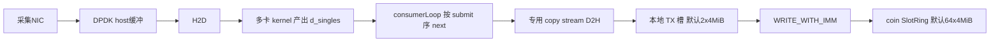
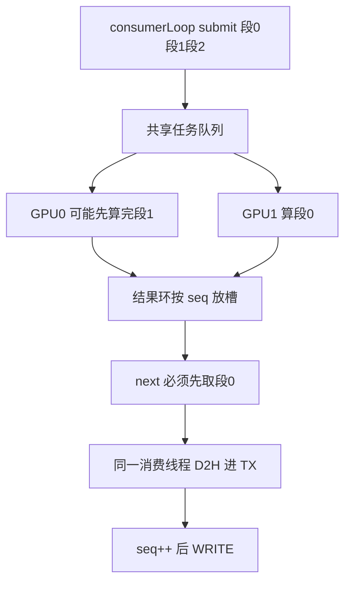
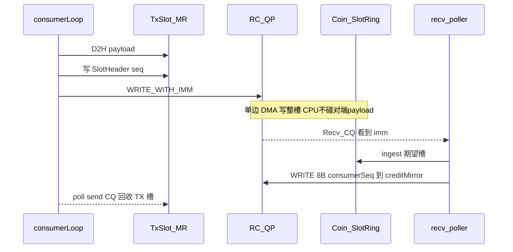

# 数据面通路现状与评价

面向指导师兄的桌面审查汇报。生产热路径是 `app_acq_r2s_node` → `R2SStreamProcessor` 有序 `next()` → `CoincidenceClient::sendSingles` → `fillRoceTxAndCommit` → `RdmaWriteSender::commitTxSlot`。**不是** GPU 直发网卡。

本次只读代码，**未上机、未跑测试**。吞吐按本仓库习惯把 `Gib/s` 当作 **Gibit/s**（30 Gib/s ≈ 3.75 GiB/s）。若按 GiB/s 解读，结论会变，见 [1.5](#15-30-gibs-理论上能否实时)。

RDMA 名词首次出现用脚注，正文只讲本项目怎么用。头文件字段仍看 [../rdma/README.md](../rdma/README.md)。

---

## 0. 先纠正数据方向

口语里容易把「上 GPU」说成 D2H。CUDA 约定相反：

| 缩写 | 方向 | 本项目热路径里出现的位置 |
|------|------|--------------------------|
| **H2D** | host → device（进显存） | DPDK/host raw → 各 GPU |
| **D2H** | device → host（出显存） | `d_singles` → 本地 RDMA TX 槽 |
| **D2D** | device → device | kernel 临时缓冲 → 该卡 `d_singles` |

因此：**raw 不在显存里等 GPU「D2H 进去」**。采集 NIC / DPDK 把 raw 放在 **host**；多卡做 H2D + kernel；singles 留在显存；再由**一条有序消费线程** D2H 进已注册的 host TX 槽，然后 NIC DMA 到对端。GPUDirect RDMA（NIC 直接读 GPU VA）**尚未实现**，见 [GPUDirectRDMA.md](../rdma/GPUDirectRDMA.md)。

`r2sNode.cpp` 里的 `PersistentNodeStreamSender` 会先 `materializeSinglesOnHost` 再入队，**不是** `app_acq_r2s_node` 热路径。下文只把它当对照。

---

## 1. 从采集到 RDMA：线程、缓冲、拷贝

### 1.1 端到端



200 Gib/s 量级的 raw **不出采集/R2S 节点**。跨机只走 singles（假设 30 Gib/s）。RDMA 段要盯的是：显存 singles → host TX → 网卡 → coin 环 → ingest。

### 1.2 发送节点上谁在跑

| 角色 | 代码 | 做什么 |
|------|------|--------|
| DPDK / 采集 | 采集侧（本审查不展开） | raw 放进 host 缓冲；lease 交给 R2S |
| GPU compute | `R2S50100MultiGpuEngine` / `R2S50100Compute` | 各卡 H2D + `DRaw2Singles`；再 D2D 到该卡 `d_singles`。**禁止**自己 `acquireTxSlot` |
| `consumerLoop` | `AsyncRawDataToR2SBridge`（[R2S.cpp](../../../../src/core/r2s/R2S.cpp)） | 从 lease 队列取段 → `processSegment`（submit）→ 管线满时 `completeOldestMultiGpuSegment`（`next()` 按 submit 序）→ `onSinglesSpanReady` |
| 回调即消费线程 | [acq_r2s_node_main.cpp](../../../../app/acq_r2s_node_main.cpp) | `coinClient.sendSingles(span, …)`；device span 生命周期到回调返回（output lease 仍活着） |
| `heartbeatLoop` | [CoincidenceClient.cpp](../../../../src/grpcService/CoincidenceClient.cpp) | 只走 gRPC Heartbeat / PAUSE，不碰 payload |

多卡算完的顺序可以乱，**发出去的顺序不能乱**。符合侧水位线按各节点已到达 singles 的时间推进；整段 raw 颠倒发送会把该节点 `maxEventTime` 推到未来，可能越过尚未到达的较早段。所以填槽、`seq++`、`post_send` 都钉在 `consumerLoop` 这一条线上：`next()` 仍按 submit 序，GPU worker 不准碰 TX。机制见下一小节。

### 1.2.1 多卡如何保证发出去的顺序

容易误会成「哪张卡算完，拷贝线程就把那张卡的显存往 TX 里填」。代码不是这样。乱的是 **算完时刻**；发出去的顺序被 `next()` 排回 **submit 序**，再由**同一条消费线程** D2H。

并行粒度是**整段 raw**，不是把一段切到 8 张卡上。每张卡算不同段，结果留在该卡 `d_singles`。调度在 [SPSCProcessor.hpp](../../../../include/core/r2s/multi_gpu/SPSCProcessor.hpp)：



1. **`submit` 发单调序号。** `consumerLoop` → `processSegment` → `submitView`。`SPSCProcessor::submit` 用 `seq_.fetch_add(1)` 得到本段序号，放入 `seq % ring_size` 的结果槽，再把任务推进共享队列。提交线程只有这一条。
2. **GPU worker 乱序算。** 各 `R2S50100Compute` 从队列里抢整段，H2D + kernel + D2D 到本卡 `d_singles`，`promise.set_value()`。GPU1 完全可能比 GPU0 先算完「更晚提交」的段。worker **不** `acquireTxSlot`，**不** D2H 进 RDMA TX。
3. **`next()` 按 submit 序取。** `completeOldestMultiGpuSegment` 调 `nextLease()` → `next()`：`next_to_pop_` 从 0 往上加，先等序号 0 那个槽的 `future`，再 1、再 2。段 1 已经在 GPU0 上算完也得等段 0。管线深度是 `computePipelineDepth`：submit 可以超前，取出仍严格有序。
4. **lease 活到回调返回。** `OutputLease` 析构才把该 GPU 结果槽标成可复用。`onSinglesSpanReady` / `sendSingles` / 整段 `fillRoceTxAndCommit` 都在这次 `next()` 的栈上，所以 D2H 期间 `d_singles` 不会被下一轮覆盖。「拷贝线程」就是 `consumerLoop`，不是每卡一条发送线程。
5. **段内按显存偏移切槽。** 回调拿到的是该卡上一段连续 `span<Single>`。`fillRoceTxAndCommit` 按 `maxSinglesPerSlot` 从 `data()+offset` 往下切，同一 `chunkId`，再 `producerSeq++` 后 `WRITE`。段内顺序 = 显存布局顺序；段间顺序 = `next()` 顺序。
6. **切 GPU 只换选用哪条 copy stream，不换序。** 相邻两段可能来自不同 device，`ensureTxD2hStream` **按 device 缓存** `cudaStreamNonBlocking`，切卡不再拆掉其它卡的 stream。这只省 create/destroy，不能让两段 D2H 重叠（仍是单消费线程）。乱序只可能发生在有人绕过 `next()` 去填 TX。

符合侧 `NodeRingBuffer::push` **按到达序追加**（RDMA `seq` / `next()` 已保序）。`minTime` 相对队尾回退只计数打日志，不重排；`chunkId` 不连续同样打日志。这**覆盖不了整段颠倒发送**：晚段先到会把该节点 `maxEventTime` 推到未来，水位线可能越过尚未到达的较早段。

口头一句：**多卡乱的是算完时刻；发出去的顺序被 `next()` 重新排回 submit 序，再由单线程 D2H。**

### 1.3 两套缓冲不要混

| 缓冲 | 在哪 | 默认尺寸 | 何时分配 | 用途 |
|------|------|----------|----------|------|
| 本地 TX 暂存环 | worker | **2** × 4 MiB（约 8 MiB） | `RdmaWriteSender::connect()` → `setupTxArena()` | 填 packed singles 的源；RoCE 下整块 `ibv_reg_mr`<sup>1</sup>。**不用大页**，避免和同机 DPDK 抢 hugetlb |
| credit 镜像 | worker，另 4 KiB | 一个 `atomic<uint64_t>` | `prepareLocalEndpoint()` | coin 把 `consumerSeq` WRITE 回来，供发送端算还能发几槽 |
| 远端接收环 | coin，**每个 worker 一份** | **64** × 4 MiB + notify[] + `consumerSeq` | `OpenDataPlane` → `ensureSession` | `WRITE` 的目的地，不是 worker 填数据的地方 |

TX 分配在 [HugepageArena](../rdma/HugepageArena.md)，但 `preferHugePages=false`，实际是普通 `mmap` + `madvise(MADV_HUGEPAGE)`。`CoincidenceClient::openRdmaDataPlane` 再对整块 `cudaHostRegister`，好让 D2H 走 pinned 路径。RoCE 下注册失败则握手失败，不进入 WaitForStart。

Coin 环布局（[SlotRing](../rdma/SlotRing.md)）：

```
[ slot0 | slot1 | … | slotN-1 | NotifyEntry[N] | uint64_t consumerSeq ]
```

每槽 4 MiB，开头 64 字节 [SlotHeader](../rdma/SlotProtocol.md)，后面是连续 16 字节 `openpni::Single`。一段逻辑 chunk 超过单槽容量就切多槽，共享 `chunkId`，用 SOF / EOF / PARTIAL 标记。单槽最多 singles：`(4 MiB − 64) / 16 = 262140`。

RoCE 热路径**不读不写 notify 环**。环仍分配并出现在端点里，只给同进程 InProcess 用。

本地 TX 默认 **2 槽**，和远端 64 槽不是同一个数：

- 远端 64 槽 = 尚未被 coin ingest 的在途窗口（credit）
- 本地 2 槽 = 「一槽在填 / 一槽在飞 WRITE」，让 D2H 和 NIC DMA 重叠，且 credit=0 时不囤已拷数据

`txSlotCount` 可配，代码里至少为 2。`fillRoceTxAndCommit` 的 CUDA 管线深等于 `txSlotCount`，默认因此就是 2。

### 1.4 填槽：从显存到 TX，几次拷贝

热路径（BDM50100 多 GPU、不写盘、不开 energy-cut / 外部 sort）假定 `onSinglesSpanReady` 拿到的是 **device** `span<Single>`。

`CoincidenceClient::fillRoceTxAndCommit`（[CoincidenceClient.cpp](../../../../src/grpcService/CoincidenceClient.cpp)）在消费线程上：

1. 按 `maxSinglesPerSlot` 切片，同一 `chunkId`。
2. 若 PAUSE，在此等待。
3. `acquireTxSlot`：在 `m_txBusy` 里找空槽；没有则 poll 本端 send CQ<sup>2</sup> 回收已完成的 WRITE，忙等后再短睡。
4. `cudaMemcpyAsync(tx.payload, d_singles+offset, …, DeviceToHost, copyStream)`，对该槽 `cudaEventRecord`。
5. 管线里最多 `depth` 个在飞拷贝；取出队头、`cudaEventSynchronize`，可选 `remapTxSlotPayload`（CPU 扫 channel），再 `commitTxSlot`。
6. `commitTxSlot`：等 credit → 写 64 B 头（`seq = producerSeq+1`）→ `WRITE_WITH_IMM`<sup>3</sup> 到远端 `(producerSeq % slotCount)`。该 TX 槽保持 busy，直到本端 send CQ 完成。

device 变了会走 `ensureTxD2hStream`：命中该 GPU 的常驻 stream；未命中才 `cudaStreamCreate`。多卡时相邻两段可能来自不同 GPU，不再每段重建 stream，也不改变「单线程有序 post」。

**热路径拷贝计数（payload，不含 64 B 头）：**

| 步骤 | 什么拷 | 谁做 | 备注 |
|------|--------|------|------|
| 采集进 host | NIC DMA → DPDK 缓冲 | 网卡 | 假设已跟上；审查不展开 DPDK 内部是否还有 copy thread |
| raw 可选 bounce | host → pinned 槽 | CPU | 仅 `tryRegisterRawViewForH2D` 失败时 |
| H2D | host raw → 该卡显存 | GPU DMA | `R2S50100Compute` |
| kernel | 显存内计算 | GPU | |
| D2D | generator 临时缓冲 → `d_singles` | GPU | [R2S50100Compute.cu](../../../../src/core/r2s/multi_gpu/R2S50100Compute.cu) |
| **D2H 进 TX** | `d_singles` 切片 → 已 `cudaHostRegister` 的 TX 槽 | 消费线程 copy stream | **RDMA 前最后一次、也是唯一一次 host 落盘式拷贝** |
| RDMA WRITE | TX MR → 对端 SlotRing | 本端 NIC DMA | CPU 不再 memcpy payload |
| coin ingest | 环内 payload → `std::vector<Single>` | poller 线程 memcpy | 单槽走 `unpackBinaryToSingles`；跨槽先拼进 `m_partialByNode` 再 `push` |

因此：显存 singles 到网卡之间 **目前必须经过 host TX**（一次 D2H）。GPUDirect 接上之后这一步才可以去掉。接收侧 ingest **不是**零拷贝进时间对齐器，槽视图只在回调返回前有效，回调里立刻拷走。

非热路径会多拷：

- 开 energy-cut / sort / 某些 remap：`completeOldestMultiGpuSegment` 先整段 D2H 到 `m_multiGpuHostSingles`，再当 host span 发给 client（host `memcpy` 进 TX，不再走 async D2H 管线）。
- InProcess：device span 同步 D2H 到临时 vector，再 `memcpy` 进同进程环。
- `r2sNode`：整段物化到 `std::vector` 再入队。

### 1.5 30 Gib/s 理论上能否实时

前置：采集和 R2S 跟得上，只评 worker→coin 的 RDMA 段。单位按 **Gibit/s**。

30 Gib/s ≈ 3.75 GiB/s。有效载荷按约 4 MiB/槽：

\[
\frac{3.75\ \mathrm{GiB/s}}{4\ \mathrm{MiB/槽}} \approx 960\ \text{槽/s}
\]

单槽间隔约 1.0–1.1 ms。100 GbE 线速约 12.5 GB/s，30 Gib/s 约占 **30%**，带宽余量足够。200 GbE 更宽裕。

时间账（数量级，非测量）：

- 4 MiB D2H：PCIe Gen3/4 x16 远小于 1 ms。
- 4 MiB RDMA WRITE：100 GbE 同样远小于 1 ms。
- 默认 2 槽 ping-pong：一槽 D2H、一槽 WRITE，两者可重叠。
- 每槽一次 `ibv_post_send` + 一次 signaled CQE，~10³ Hz，对 CPU/CQ 都不构成压力。

**单 worker、一条 RC QP<sup>4</sup>、默认 2×4 MiB TX：按 30 Gibit/s 在带宽和单槽时延上都理论上能实时。** 多卡只增加 R2S 算力，**不增加发送并行度**——仍然一条消费线程、一条 QP、一套 TX。卡数变多不会让 RDMA 变成多 QP 并发；只要该节点 singles 总量仍是 ~30 Gib/s，发送侧形状不变。

更容易先顶满的不是线速，而是：

1. **coin ingest 反压**：时间对齐器满 → ingest 返回 false → credit 不涨 → 发送端停在 `waitForCredit`。这是设计如此，不是卡死。
2. **`cudaHostRegister` 失败**：D2H 走 pageable，时延可能从远小于 1 ms 变成不可忽略（代码有 WARNING，本次未测）。
3. **整段先 D2H 的旁路**（energy-cut / 写盘 / `r2sNode` 物化）：丢掉「按槽流水」的重叠。
4. **多 worker 汇入同一 coin NIC**：每条 QP 30 Gib/s 量级时，要按 worker 数加总再和 coin 网卡比；本审查只看单条 worker→coin 链路。

若把 30 Gib/s 读成 30 **GiB**/s（240 Gbit/s），单条 100/200 GbE 都不够，必须换单位或加网卡。下文按 Gibit 口径。

### 1.6 当前缓冲大不大、再加大有没有用

**结论：加大缓冲主要加排队时延和抗抖动，不加 100 GbE 线速。** 默认 2×4 MiB TX 在 30 Gibit/s 下已经能做 D2H / WRITE ping-pong。先测 CQ / credit 等待，再决定要不要把 TX 从 2 调到 4（实验步骤见 [优化方案.md](优化方案.md)）；不要把「把 TX 开到几十槽」当成吞吐优化——那是在 credit 不足时囤已拷数据，和当初选 2 槽的动机相反。

把三套尺寸分开看（速率仍用 §1.5 的 3.75 GiB/s、约 960 槽/s）：

| 旋钮 | 默认 | 加大之后发生什么 | 对实时传输 |
|------|------|------------------|------------|
| 本地 `txSlotCount` | 2（约 8 MiB） | 3～4 可以让更多 D2H 与在飞 WRITE 重叠。`fillRoceTxAndCommit` 的 CUDA 深等于 `txSlotCount` | 2→4 可能有用（D2H 或 send CQ 有等待时）。再加大只多占已 D2H 的槽；credit=0 时 `commitTxSlot` 照样堵住，多出来的槽帮不上线速 |
| 本地 / 远端 `slotBytes` | 4 MiB | WR 更少，单次 D2H / WRITE 更长，credit 粒度更粗 | ~960 Hz 的 `post_send` 本来就不构成压力，加大槽几乎无带宽收益，尾延迟更差。coin `maxSegmentSingles = 262144` 约等于一槽；再加大槽还要改符合攒批上限 |
| 远端 `slotCount`（credit 窗） | 64（每 worker 256 MiB） | 在途更长：256 MiB / 3.75 GiB/s ≈ **68 ms** | **只吸收** coin ingest / 对齐器抖动，**不加快** NIC DMA。再加大等于让 worker 更晚才被反压 |
| R2S `computePipelineDepth` / GPU 结果环 | 与 TX 独立 | 多段可以在 GPU 上算着 | 消费线程仍要整段 D2H+发送完才放 `OutputLease`。加大 GPU 环救不了发送侧只有 2 个 TX 槽 |

为什么 2 个 TX 槽在账面上够：一槽约 1.0–1.1 ms 的 singles；4 MiB D2H 和 4 MiB WRITE 在 PCIe / 100 GbE 上都应远小于 1 ms，两槽即可重叠。第三、第四槽只在「D2H 或 CQ 回收偶发偏慢」时提供余量，不是把 3.75 GiB/s 再抬一截。

远端 64 槽对照符合侧 `maxProcessLatencyMs = 50`：credit 窗约 68 ms，与对齐器处理时延上界同量级，**并非明显偏小**。把 RX 开到 256 槽（每 worker 1 GiB）只会让对齐器更晚才把压力传回采集，实时上往往更差。把 RX 收到 16 槽（约 17 ms）会更早 `waitForCredit`，适合查 coin 是否跟不上，不适合当默认。

`slotBytes` 也不宜当「一次多传点就更快」：4 MiB 已经远大于以太网 MTU；再大只会让一次 ingest 失败卡住更多数据，并和 `maxSegmentSingles` 脱节。

口头一句：**线速够不够看 NIC 和 D2H，不看把 TX 开多大；credit 窗是抖动缓冲，加大它等于推迟反压。**

---

## 2. 发送端和接收端怎么通信

分三层，不要和「TX 里刚拷进数据」混在一起。

### 2.1 控制面（启动时一次，之后偶发）

gRPC **不传 singles**。`StreamSingles` 已 UNIMPLEMENTED。

握手（[CoincidenceClient::openRdmaDataPlane](../../../../src/grpcService/CoincidenceClient.cpp) / coin `OpenDataPlane`）：

1. Worker `RegisterNode`。
2. `prepareLocalEndpoint`：本地 QP 到 INIT，注册 4 KiB credit 镜像 MR，交出 GID / QP / PSN / creditMirror 地址和 rkey<sup>5</sup>。
3. `OpenDataPlane`：coin `ensureSession` 建 SlotRing 并 `ibv_reg_mr`；RoCE 下 `acceptRemote` 把 QP 推到 RTR/RTS，并 `postRecvBatch`（默认最多 128 个空 Recv WR<sup>6</sup>，SGE 长度 0，只为收 immediate）。
4. 响应带回 coin 端点（rkey、baseAddr、slotCount、slotStride、consumerSeq 地址）。
5. Worker `connect`：QP 到 RTS，按远端 stride 分配 TX 并注册，再 `cudaHostRegister`。
6. 双方都 open 后 `WaitForStart`；之后 singles 只走槽环。Heartbeat 可下发 PAUSE（停入队，QP 保持）。

`requested_slot_count` / `requested_slot_bytes` **只打日志**，环大小由 coin 的 `RdmaRecvServer::Config` 决定。

### 2.2 数据面：TX 填好之后发生什么

**不是**「缓冲区有数据就 RPC / 发消息」。数据进 TX 只是本端准备好了源地址；对端发现「槽就绪」靠 `WRITE_WITH_IMM`。



要点：

- `WRITE` 是单边操作：本端 NIC 从 TX MR DMA 到对端已注册的 SlotRing。coin **CPU 不参与搬 payload**。
- 带 immediate 是为了在对端 Recv CQ 上产生一条完成事件，当作门铃。payload 已经在对应槽里。
- 权威序号是 64-bit 的 `m_nextExpectedNotifySeq` 和槽头 `seq`。IMM 只取低 32 位（`seqToImm`），对不上就打日志并丢掉这次门铃，**不推进 expected**（若此时没有 `pendingReady`）。
- 只 ingest「下一期望槽」`slotIndex = (expected-1) % slotCount`，然后 `++expected`。RC 保证同一 QP 上 WRITE 到达序 = post 序。
- ingest 失败（例如 aligner 满）：记下 `pendingReady`，下次 `pollOnce` **先重试该槽**，不依赖第二次 IMM。RoCE Recv CQ **一次只取 1 条**，避免失败时把后续 IMM 抽走后丢失门铃。
- 多 worker 之间没有跨 QP 的槽序。跨节点对齐靠 TimeAligner 的时间水位，不靠 RDMA `seq`。

InProcess（无 verbs / `forceInProcess`）：调用线程 `memcpy` 进同进程环，release fence 后写 `NotifyEntry.seq`；poller 扫 notify 环找 `seq == nextExpected`。槽协议和 credit 语义与 RoCE 相同，门铃机制不同。

### 2.3 反压（credit）

远端环只有 64 槽。发送端在 `commitTxSlot` 里要求：

```
needProducerSeq - consumerSeq < slotCount
```

不满足就自旋 / yield / 睡 10 µs，并顺带回收本端 send CQ。

`consumerSeq` 怎么回来：

1. coin ingest 成功 → `releaseSlot`：`consumerSeq.fetch_add(1)`，再 `postWrite` 这 8 字节到 worker 的 `creditMirror`（每 8 次或 SQ 接近上限才 signaled）。
2. worker 对 `creditMirror` 做 `memory_order_acquire` load。

因此：**credit 也走同一条 RC QP 上的 RDMA WRITE**，不是 gRPC。aligner 满时 credit 不涨，worker 停在 `waitForCredit`；本地 TX 只有 2 槽，不会在远端满时继续 D2H 囤数据。这是正确反压。

发送端 TX 槽回收是另一件事：`WRITE_WITH_IMM` 全部 `signaled=true`，`wr_id = localIndex+1`。send CQ 完成后才把 `m_txBusy[i]` 清掉。没 CQ 就没空槽，`acquireTxSlot` 会等——这限制的是「NIC 是否还在读这块 TX」，不是远端 64 槽窗口。

---

## 3. 设计是否合理

### 3.1 合理处

- **有序单发送线程**和多卡并行计算拆开，避免完成序打乱 RC 与符合水位线。这是当前结构里最重要的约束。
- TX 不用大页、与 DPDK 隔离；远端环默认用大页做 MR，适合 NIC DMA。
- 2 槽 TX + 64 槽远端 credit：D2H 与 WRITE 可重叠，又不会在 credit=0 时囤已拷数据。
- 门铃用 IMM、payload 用单边 WRITE，coin CPU 不搬 4 MiB。
- ingest 失败不抽空 CQ，避免丢掉后续 IMM 后永久卡住 `expected`。
- 热路径 span 是 device，D2H 直写已注册 TX，避免「整段 pinned host 再 memcpy」。

### 3.2 线程安全（代码约束，非实测）

热路径假定 **`sendSingles` 只从 `consumerLoop` 调**。`RdmaWriteSender` 另有 `m_sendMutex`：`acquireTxSlot` / `commitTxSlot` / `abortTxSlot` / `sendPackedSingles` 都进锁。心跳线程不填槽、不 `post_send`。

需要说清的点：

- `m_txBusy` 是普通 `vector<uint8_t>`，不是原子，全靠 mutex。lease 在 D2H 期间**跨锁持有**（`acquire` 返回后解锁，拷完再 `commit` 加锁）。这依赖「同时只有一个填槽者」。若 GPU worker 也 `acquireTxSlot`，busy 位和 `seq` 都会乱——代码用注释和接线禁止，没有运行时断言。
- `fillRoceTxAndCommit` 可同时占最多 `depth` 个 lease（默认 2）。单消费线程内这是排队，不是并发写同一槽。
- recv：`pollLoop` 每次复制一份 `shared_ptr` 列表，**不持** `m_mutex` 做 `pollOnce` / ingest。`ensureSession` 与 poller 靠 session 的 `shared_ptr` 存活。`ingestRdmaSlot` 拼跨槽时用 `m_partialMutex`。
- 发送、接收各自 **send/recv 共用一个 CQ**。coin poller 必须忽略本端 credit WRITE 的 send WC，只处理 recv IMM——`pollVerbsCompletions` 已跳过 `!isRecv`。worker 回收 TX 时跳过 `isRecv`（正常不应在 worker CQ 上看到 recv）。
- `creditMirror` 是远端 DMA 写入的 `atomic<uint64_t>`。C++ 内存模型管不到 NIC 写；工程上依赖 RoCE 写完 + acquire load。8 字节对齐由 arena 布局保证。
- InProcess 的 notify 环用 `atomic_thread_fence` + 普通写 `seq`，不是 `atomic<uint64_t>` 字段。同进程 + 单 poller 下可用，不要当跨机协议。

未发现「热路径上两个线程无锁对写同一 TX 槽」的接线。风险在于：**约定靠纪律**（禁止 GPU 填槽），而不是类型系统。

### 3.3 多余或不理想的开销

按对 30 Gib/s 的影响大致排序：

1. **强制 D2H，无 GPUDirect。** 显存 → 网卡多一跳 PCIe。带宽上 3.75 GiB/s 仍应可过，但占 GPU 的 copy engine。这是档位问题，不是实现笔误。
2. **接收侧又 memcpy 进 `vector`。** 槽视图本可零拷给下游；现在单槽 `unpackBinaryToSingles`，跨槽再拼 `m_partialByNode`。30 Gib/s 的 memcpy 对 CPU 通常可承受，但是热路径上明确多出来的一次。
3. **payload WRITE 全部 signaled。** 2 槽 TX 必须靠 CQ 回收，这项消不掉。credit WRITE 改为每 8 次 signaled，减轻与 IMM 挤同一 CQ 的噪音。
4. **RoCE 仍分配 notify 环。** 每 session 64×`sizeof(NotifyEntry)`，可忽略，但端点字段容易让人以为热路径还在扫 notify。
5. **空转 `sleep 10 µs`。** 有数据时连续 `pollOnce(16)`；空闲时最多约 100 kHz 空转。session 列表只在 `ensureSession` / `stop` 时刷新。
6. **`remapLocalToGlobalChannels`。** D2H 之后 CPU 扫整槽改 `channelIndex`。可关则关；或放到 GPU 上做。
7. **`cudaHostRegister` 失败现在会让 RoCE 握手失败**，避免 pageable D2H 静默打穿实时预算。
8. **`maxPendingChunks` JSON 仍解析，热路径忽略。** 心跳里的 `chunks_pending` 实际是本地 TX busy 数，不是应用层队列深度。

不算错误、但汇报时容易问到的点：每条 payload WRITE 都带 64 B 头（占比 ~0.0015%）；CRC 字段存在但为 0（未用）。

### 3.4 和现有 `rdma/` 文档的偏差

本次不改那些页。对照代码后：

- [README.md](../rdma/README.md) 对热路径、2 槽 TX、IMM 门铃、credit、禁止 GPU 填槽的描述与代码一致，可作为接口导读。
- 「raw 2 次拷贝（host memcpy + H2D）」只在 `tryRegisterRawViewForH2D` 失败时成立；成功注册 DPDK 缓冲则没有那次 host bounce。
- GPUDirect 页写明未实现，与代码一致（无 `ibv_reg_mr(GPU)`、无相关 JSON）。
- `r2sNode` 物化路径若被误当成生产接线，会多算一次整段 D2H。以 `app_acq_r2s_node` 为准。

### 3.5 ADR：水位线与 RDMA 接收环保持双缓冲

**决定：** 不把 coin 的 RDMA `SlotRing` 做成水位线（不对齐器持 RX 槽指针 / 租约；不把 credit 拖到水位切走）。ingest 仍 `memcpy`/`unpack` 进每节点 `NodeRingBuffer`，成功后立刻涨 credit。

**否决 RX 租约零拷的原因：**

- 水位等的是各节点 PET `maxTime` 到齐，不是 RDMA `seq` 乱序。跨节点 skew 时快节点的数据必须独立持有。credit 若绑到水位消费，快节点 RX 先满、worker `waitForCredit`，切分线程却在等慢节点，形成互等。
- 归并进 GPU 输入槽时仍然要 copy / H2D。零拷只省 ingest 那一次 memcpy，却让发送更早卡住，切分喂卡更慢。
- 上界 `maxSegmentSingles` 靠半块 `consumed` + `reinsertFront`；丢掉半块无法在 carry 吃掉预算时切开。跨槽 SOF/EOF/PARTIAL 不拼会改 `chunkId` 与 Test 9 分段契约。

RDMA 有序 **不能** 取消跨节点水位。容易混在一起的旋钮：

| 旋钮 | 作用 | 与 RDMA 有序 |
|------|------|----------------|
| `networkLatencyMargin_pico`（默认 **0**） | 从水位再减去的 PET 时间 | **不是**墙钟等包。有序到达后再扣若干毫秒只增加持有量 |
| `getTotalSafetyMargin` 的 `max(timeWindow, delayTime)` | 约 2 µs delay 窗 | **保留**：边界事件需要对端窗口内的伴事件 |
| `maxProcessLatencyMs`（默认 50） | 到期触发切段，仍不得越过水位 | 不是等待；0 = 关掉墙钟兜底触发 |
| `processingIntervalMs` | 无 push 时空转上限 | 不是网络延迟；push 会唤醒 |
| `allowStalledNodeBypass` | 默认关 | 慢节点死等，不因有序而打开 |

切分上下界（硬下界重叠窗、软下界攒批、`maxSegmentSingles`、steal 整块、半块 reinsert）不变。加速靠 credit 与水位解耦 + 有序追加，不靠加大 RX、不靠合并两级环。

---

## 4. 给师兄的口头摘要

1. 数据面是 RoCE 槽环，不是 gRPC 流。GPU 算出的 singles 先 D2H 进 8 MiB 本地 TX，再由网卡 DMA 到 coin 上每节点 256 MiB 的接收环。
2. 两端平时不「对话」：发送端 post `WRITE_WITH_IMM`；接收端 CQ 响一下去读已经写好的槽；读完把 8 字节序号写回来当 credit。
3. 多卡乱的是算完时刻；`next()` 把取出序排回 submit 序，同一条消费线程再 D2H。不是哪张卡算完就往 TX 里填。
4. 30 Gibit/s 对单条 100 GbE、默认 2 槽流水，账面上够。**加大 TX/RX 几乎不加线速**，credit 窗约 68 ms，再加大等于更晚反压。先担心对齐器反压和 `cudaHostRegister` 失败。
5. 结构上有序单线程发送是对的。可做的优化见 [优化方案.md](优化方案.md)（不含 GPUDirect，也不做接收环零拷贝进对齐器）。

---

## 脚注（RDMA 用语）

1. **MR（Memory Region）**：把一块虚拟地址登记给网卡，得到 lkey/rkey。没有登记，NIC 不能 DMA。
2. **CQ（Completion Queue）**：`ibv_post_send` / `ibv_post_recv` 完成后的通知队列。本项目发送、接收共用一个 CQ。
3. **`WRITE_WITH_IMM`**：RDMA WRITE 同时带 4 字节 immediate。对端 CPU 不搬 payload，但 Recv CQ 上会出现一条带 imm 的完成。本项目 imm = `seq` 的低 32 位。
4. **RC QP（Reliable Connected Queue Pair）**：一对一、有序、可靠的 verbs 连接。本项目每个 worker↔coin 一条。同一 QP 上 post 序 = 到达序。
5. **rkey**：对端 MR 的远程密钥。WRITE 时必须带对端 rkey 和远程虚地址。
6. **Recv WR**：预先挂在 QP 上的「我准备收一条带 immediate 的完成」。SGE 长度为 0，因为 payload 已经 WRITE 进 SlotRing，这里只收门铃。
