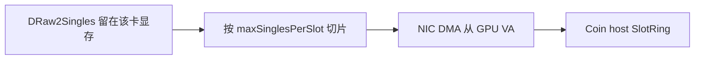
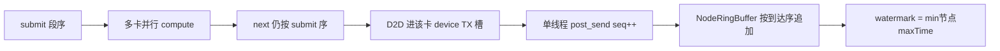

# GPUDirect RDMA（未实现）

本页是 **档 2** 的设计说明：把 R2S 产出的 device singles 经 `nvidia_peermem` 注册成 verbs MR，由 NIC 从 GPU VA DMA 到对端 coin 的 host [SlotRing](SlotRing.md)。**本仓库尚未实现**，没有 `ibv_reg_mr(GPU)`、没有 `enableGpuDirectRdma` JSON、没有采集侧 GPUDirect 入 GPU。实现阶段按本页，不要改槽协议。

热路径现状：有序 `next()` 之后，消费线程用专用 non-blocking stream 把 device singles `cudaMemcpyAsync` 进已 `ibv_reg_mr` 且 `cudaHostRegister` 的 TX 槽。现行发送模型见 [README.md](README.md#发送端缓冲)。通路边界见 [R2S到RDMA](../../通路/R2S到RDMA.md)。

## 原理

RoCE WRITE 的 **本地源** 必须是已 `ibv_reg_mr` 的虚拟地址。档 1 的源是 hugepage TX 槽；GPUDirect 把 **CUDA device 指针** 交给 `nvidia_peermem`，NIC 走 GPU BAR / PCIe P2P，把 payload DMA 到 **对端 coin 的 host SlotRing**（对端仍是 hugepage，不变）。

本端 CPU 仍要：`acquire` 信用、填 `SlotHeader`（或 GPU 写头）、`ibv_post_send`、收 CQ、按 credit 回收 **显存槽**。Payload 路径不再经过 host memcpy，也不再 D2H。

## 数据模型（与现槽协议对齐）

契约不变：[SlotHeader 64 B](SlotProtocol.md) + 紧随其后的 packed 16 B `Single`；SOF/EOF/`chunkId`/`seq`；一条 worker↔coin **RC QP**，`seq` 单调。符合侧 ingest 与水位线语义也不变。

建议模型：

| 项 | 做法 |
| --- | --- |
| 每 GPU 一块 device TX 环 | 槽数与本地 `txSlotCount` 同量级或略大；每槽 stride = `kDefaultSlotBytes`（4 MiB），布局与 host 槽相同（64 B 头 + payload）。可用 `cudaMalloc`（或驱动要求的 pinned device alloc）。 |
| 注册 | 对每块 device 环一次 `ibv_reg_mr`（依赖 `nvidia_peermem`）。失败则该节点不能开 GDR。 |
| 产出 | `R2S50100Compute` 不再 D2H；kernel 输出留在 device，再 **device-to-device** 按槽切片拷进该卡的 device TX 槽（或 kernel 直接写槽 payload）。 |
| 头 | **整槽在 GPU**：头由小 kernel 或 `cudaMemcpy` 写到 device 槽。不采用「头在 host、payload 在 GPU」的两次 WR。 |
| 多卡 → 一 QP | 8 卡完成顺序 ≠ 段序。仍由 **单发送线程** 按 SPSC `next()` 的 submit 序 `post_send`，保证 `seq` 与 chunk 边界。某卡算完但前一段未 post 则排队，**禁止 GPU worker `acquireTxSlot` / `post_send`**。 |
| 信用 | 远端 ring 满时不能 post；对应 **device 槽** 等到 CQ（及 credit）才能还给该卡 compute ring。 |
| 切槽 | 一段 ~637 MB 仍切成 ~150 个 4 MiB WRITE，与现在 `fillRoceTxAndCommit` 相同；只是源地址从 host payload 换成 GPU VA。 |

有序性与档 1 相同：`NodeRingBuffer` 按到达序追加（RDMA `seq` 已保序）；**覆盖不了整段 raw 颠倒发送**。晚段先到会把该节点 `maxEventTime` 推到未来，水位线可能越过尚未到达的较早段，符合配对会丢。直写 GPU 槽 **不改变** 这条序。水位线与 RX 槽保持双缓冲，见 [数据面通路现状与评价.md](../design/数据面通路现状与评价.md) §3.5。

## 潜在风险

- **网卡**：ConnectX-6 及以上 + 驱动 / `nvidia_peermem`。Intel E810 **不能** 作为本端 GDR 源。现 [四机推荐配置](../../../app以及实验配置/四机推荐配置.md) 允许 E810 **或** CX-6，因此 GDR **不能当默认路径**。
- **拓扑**：GDR 要求 GPU 与 RNIC 有 PCIe P2P。8 卡一 NIC 时，跨 socket / 无 P2P 的卡会 **绕回 host**，可能比档 1 更慢。启动时探测 P2P；**失败则整节点拒绝 GDR 并报错**，不静默混用档 1/档 2（混用难以测准）。
- **IOMMU / ACS / BAR1**：映射失败或性能断崖；运维清单须覆盖关 ACS、确认 IOMMU 策略、BAR1 大小。
- **显存占用与反压**：信用不足时 device 槽不回收 → 该卡 `compute` ring 停。8 卡 × 每段 150 槽不现实，必须 **槽环深度有限 + 按槽流水 post**，不能「整段显存等一次 CQ」。
- **有序 QP**：多卡乱序完成 vs 单 QP 有序；实现错误会导致 coin 槽错段。
- **头与 CRC**：已选定整槽在 GPU。若改成头 host + payload GPU，一次槽变成两次 WR，seq/imm 更难对齐。
- **注册粒度**：大块 `ibv_reg_mr(GPU)` 可能失败或慢；按槽注册则 QP/MR 压力大。建议「每 GPU 一整环一次注册」。
- **与现 lease**：今日 output lease 管 **device singles 直到回调结束**（档 1 在回调里 D2H 进 host TX）。GDR 后 lease 必须管 **device TX 槽直到 CQ**，热路径 `onSinglesSpanReady` 的 host/device span 语义要改或取消。
- **调试**：InProcess memcpy 无法模拟 GDR；CI 仍走 host MR。

## 明确不在本阶段实现

- 不实现 GPU VA `ibv_reg_mr` / `nvidia_peermem` 接线。
- 不增加 `enableGpuDirectRdma` JSON（将来字段默认 `false`：开启时探测 peermem + P2P，失败报错退出、不静默回退）。
- 不做 GPUDirect 入 GPU 的采集路径。

实现时按本页数据模型切入，并保持与 [R2S50100MultiGpuEngine](../../core/r2s/multi_gpu/R2S50100MultiGpuEngine.md) 的 submit/next 段序一致。现行槽协议与发送序见 [README.md](README.md)。
