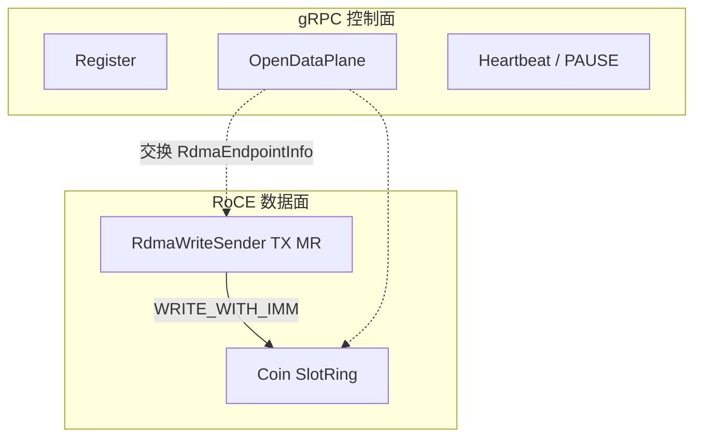
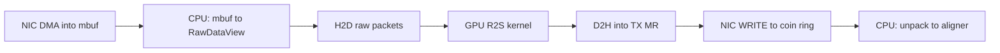

# RDMA 数据面

本页是 `dataplane/rdma` 的总览：RoCE 传输原理、本仓库槽环设计、热路径上的拷贝次数与可优化点。各头文件字段见同目录其余页。通路边界见 [R2S到RDMA](../../通路/R2S到RDMA.md)。握手与 credit 调试见 [状态机与调试.md](../../../app以及实验配置/状态机与调试.md)。

## RoCE 原理

RDMA（Remote Direct Memory Access）让本机网卡把数据 DMA 进对端已注册内存，CPU 不参与 payload 搬运。本项目用 **RoCE v2**（UDP/IP 上的 InfiniBand RC），verbs 设备经 `ibv_*` 访问。

要点：

- **MR（Memory Region）**：`ibv_reg_mr` 把一段虚拟地址注册给网卡，得到 `lkey`/`rkey`。只有注册过的缓冲才能作为 WRITE 的源或目的。本仓库用 [HugepageArena](HugepageArena.md) 分配后再注册。
- **QP（Queue Pair）**：每条连接一对 Send/Recv 队列。本项目用 **RC**（Reliable Connection）：按序、可靠、对应一条 worker↔coin 会话。
- **WRITE**：本端给出本地地址+lkey、远端 VA+rkey、长度；网卡把字节写到对端内存。对端 CPU 默认不知道写完，除非再通知。
- **WRITE_WITH_IMM**：WRITE 同时带 32-bit Immediate。对端 Recv 完成队列上能看到 imm（本项目用它携带生产者 `seq` 的低 32 位），从而知道哪一槽就绪。
- **Credit**：远端接收环是固定槽数。生产者序号超过 `consumerSeq + slotCount` 时必须等待，否则覆盖尚未 ingest 的槽。coin 推进 `consumerSeq`（并可 WRITE 回 worker 的 credit 镜像）。

**Payload 不走 gRPC。** gRPC 只交换端点（GID/QP/rkey/槽布局）和编排命令。16 字节 `Single` 只出现在槽 payload 里。

无 verbs 设备或 `forceInProcess` 时，用同进程 memcpy 模拟 WRITE（[DataPlaneKind::InProcess](RdmaTypes.md)），协议头与 credit 语义不变，便于 CI。

## 本项目设计

控制面与数据面分离：



1. Worker `RegisterNode`，再 `OpenDataPlane`：本端 [RdmaWriteSender::prepareLocalEndpoint](RdmaWriteSender.md)，对端 [RdmaRecvServer](RdmaRecvServer.md) 建 [SlotRing](SlotRing.md)，经 [ProtoConvert](ProtoConvert.md) 交换 [RdmaEndpointInfo](RdmaTypes.md)。
2. `registered==N && dataplane_open==N` 后 Start。之后 singles 只走槽环。
3. 一块逻辑 chunk 可拆成多槽，共享 `chunkId`，[SlotHeader](SlotProtocol.md) 用 SOF/EOF/PARTIAL。默认 64 × 4 MiB。
4. Recv poll notify（或 imm）得到 [SlotChunkView](RdmaTypes.md)；`singlesPacked` 仅在 ingest 回调返回前有效。
5. Heartbeat 带 pending/credit 遥测，并可下发 PAUSE（停入队，QP 保持）。

环布局（coin 每节点一份）：

```
[ slot0 | ... | slotN-1 | NotifyEntry[N] | uint64_t consumerSeq ]
```

头文件阅读顺序：[RdmaTypes](RdmaTypes.md) → [SlotProtocol](SlotProtocol.md) → [HugepageArena](HugepageArena.md) / [SlotRing](SlotRing.md) → [RdmaContext](RdmaContext.md) → [RdmaWriteSender](RdmaWriteSender.md) / [RdmaRecvServer](RdmaRecvServer.md) → [ProtoConvert](ProtoConvert.md)。

## 拷贝与优化

以下针对 **BDM50100 在线路径 + RoCE、不写盘**。`RawDataLease` 只传 `RawDataView` 指针，不拷 packet bytes。`app_acq_r2s_node` 绑 `onSinglesSpanReady`（不再走 `materializeSinglesOnHost`）。



| 步 | 位置 | 数据 | 是否 CPU memcpy |
|----|------|------|-----------------|
| 0 | DPDK RX | raw | NIC DMA，不算 host 拷贝 |
| 1 | DPDK copy 线程 | raw | 是（mbuf → 连续 `RawDataView`） |
| 2 | `DPacketsAsync::ReserveFromHost` | raw | H2D |
| 3 | `DRaw2Singles` 后 D2D 到 `d_singles` | 变换 | kernel + device 拷，不是 host 拷贝 |
| 4–5 | `PinnedHostCopy` / 引擎 pinned / `materializeSinglesOnHost` | singles | **热路径已消**。energy cut / 外部 sort / 写盘 / `onSinglesReady` 仍 D2H 到 host |
| 6 | `fillRoceTxAndEnqueue` | singles | **D2H 直写**已 `ibv_reg_mr` 且 `cudaHostRegister` 的 TX 槽（`acquireTxSlot` 必须在有序 `next()` 之后的单消费线程；禁止 GPU worker 填槽） |
| 7 | RoCE `WRITE_WITH_IMM` | singles | NIC DMA，CPU 不碰 payload |
| 8 | ingest | singles | 单槽 SOF+EOF：**是**（`unpack` 进 aligner 自有 vector，随后立刻 `releaseSlot`）；跨槽：各槽 memcpy 进 `vector<Single>`，EOF 时 **move** |

InProcess：device span 先 D2H 进 pending host 缓冲，再 memcpy 进接收环；不能把 device 指针当 borrowed span。

合计（worker RoCE 在线路径）：raw **2 次**（host + H2D）；singles **一次 D2H 进 TX** + 单槽 ingest 再 1 次（步 8），再加网络 DMA。符合 GPU 的 H2D 在 aligner 之后，不算本段。

拷贝阶梯：

| 档 | 做法 | 相对现状 | 硬件 | 状态 |
| --- | --- | --- | --- | --- |
| 0 | D2H → 额外 pinned → memcpy TX MR | 两次 host 落地 | 任意 RoCE | 已被档 1 替换 |
| 1 | 有序 `next` 后 `cudaMemcpy` D2H 进已注册 TX 槽 | 去掉 memcpy 与引擎 pinned | E810 或 CX | **热路径** |
| 2 | GPUDirect：显存 VA 注册 MR，NIC 从 GPU DMA | 去掉 D2H 与 memcpy | 仅 ConnectX + `nvidia_peermem` | [未实现，见 GPUDirectRDMA.md](GPUDirectRDMA.md) |

未落地：采集侧 DPDK 零拷贝或 GPUDirect 入 GPU，去掉步 1（下一阶段）。当前 `app_acq_r2s_node` 的 `source.type=acquisition` 仍是 stub；上表描述的是接上 DPDK 后会走的路径。

档 2 细节、数据模型与风险见 [GPUDirectRDMA.md](GPUDirectRDMA.md)。[四机推荐配置](../../../app以及实验配置/四机推荐配置.md) worker 网卡是 E810 **或** CX-6，因此 GPUDirect 不能当默认。将来若加 `dataplane.enableGpuDirectRdma`（默认 `false`）：开启时探测 `nvidia_peermem` + P2P + verbs GPU MR，失败则报错退出、不静默回退。本批不改 JSON。