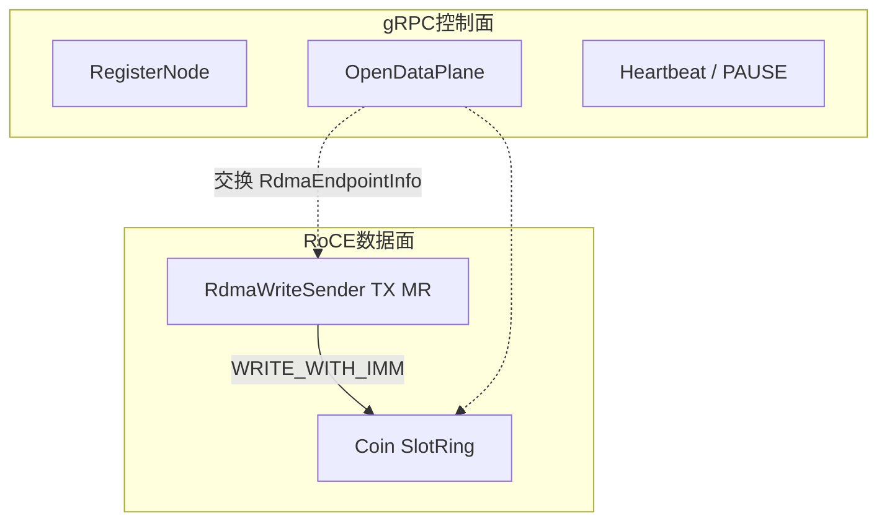
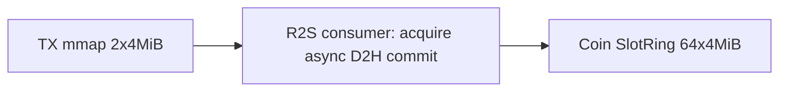
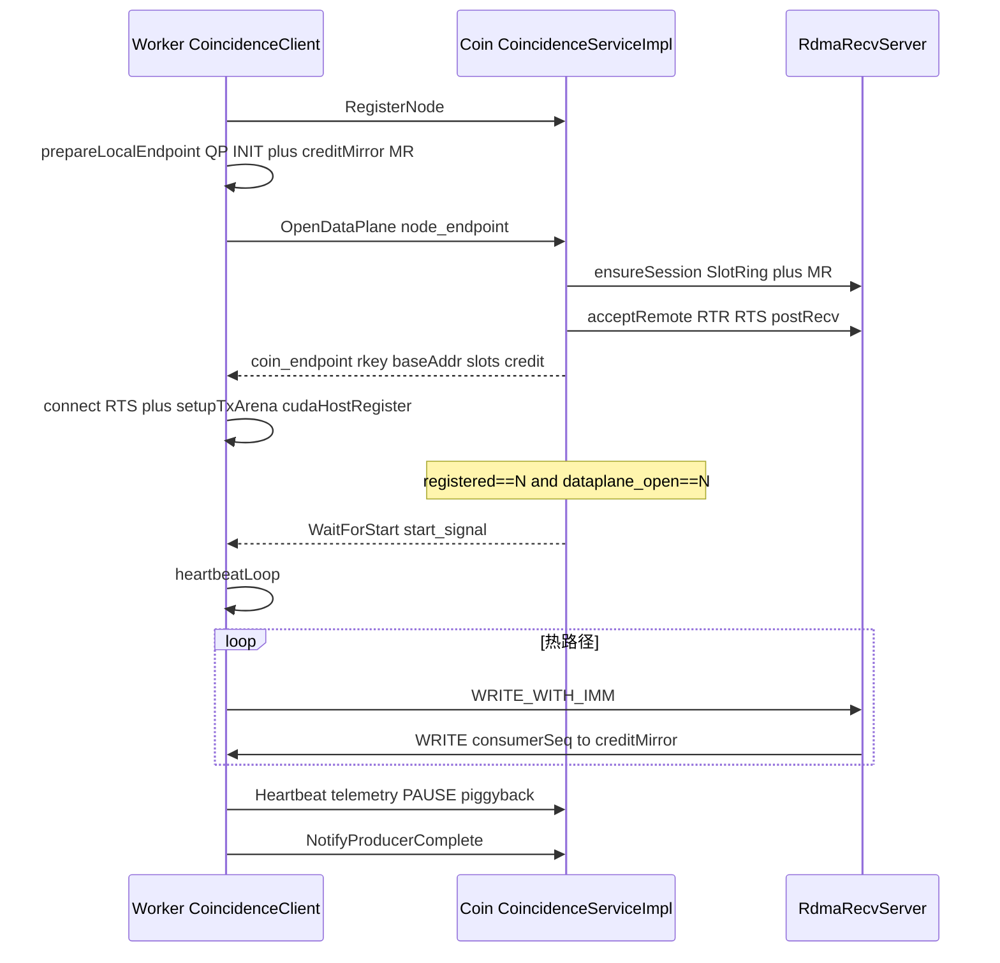

# RDMA 数据面

本页描述 **当前** worker↔coin 数据面实现：发送端 TX 缓冲如何预分配与填槽、接收端如何得知槽就绪并保持有序、以及 gRPC 控制面如何交换端点。各头文件字段见同目录其余页。通路边界见 [R2S到RDMA](../../通路/R2S到RDMA.md)。握手与 credit 调试见 [状态机与调试.md](../../../app以及实验配置/状态机与调试.md)。

生产路径是 `app_acq_r2s_node` 的 [CoincidenceClient](../../grpcService/CoincidenceClient.md) + coin 的 `CoincidenceServiceImpl`。`r2sNode.cpp` 里另有一套 `PersistentNodeStreamSender`（先 host 物化再 `sendPackedSingles`），不是本页描述的热路径。

头文件阅读顺序：[RdmaTypes](RdmaTypes.md) → [SlotProtocol](SlotProtocol.md) → [HugepageArena](HugepageArena.md) / [SlotRing](SlotRing.md) → [RdmaContext](RdmaContext.md) → [RdmaWriteSender](RdmaWriteSender.md) / [RdmaRecvServer](RdmaRecvServer.md) → [ProtoConvert](ProtoConvert.md)。

## 控制面与数据面

**Payload 不走 gRPC。** `StreamSingles` 已 UNIMPLEMENTED。gRPC 只交换端点（GID/QP/rkey/槽布局）和编排命令（Register / OpenDataPlane / WaitForStart / Heartbeat / PAUSE / NotifyProducerComplete）。16 字节 packed `Single` 只出现在槽 payload 里。

本项目用 **RoCE v2** RC QP：`WRITE_WITH_IMM` 把已注册的本地 TX 槽 DMA 到对端 [SlotRing](SlotRing.md)。无 verbs 设备或 `forceInProcess` 时走同进程 memcpy（[DataPlaneKind::InProcess](RdmaTypes.md)），槽头与 credit 语义不变。



## 发送端缓冲

两套内存不要混为一谈：

| 缓冲 | 位置 | 默认尺寸 | 何时分配 | 用途 |
|------|------|----------|----------|------|
| 本地 TX 暂存环 | worker | **2** × `slotStride`（默认 4 MiB，约 8 MiB） | `connect()` 时 `setupTxArena()` | 填 packed singles 的源；RoCE 下整块 `ibv_reg_mr`。**不用 hugepage**，避免与同机 DPDK 抢 hugetlb |
| 远端接收环 | coin，每 worker 一份 | **64** × 4 MiB + notify + `consumerSeq` | OpenDataPlane `ensureSession` | WRITE 目的地，不是 worker 填数据的地方 |

TX 用 [HugepageArena](HugepageArena.md) 分配普通 mmap（`preferHugePages=false`）后 `ibv_reg_mr`。CoincidenceClient 再对整块 `cudaHostRegister`，device span 用消费线程专用 non-blocking stream `cudaMemcpyAsync` 直写已注册槽。credit 镜像是另开的 4 KiB MR，供 coin 把 `consumerSeq` WRITE 回来。

```
Coin SlotRing:
[ slot0 | ... | slotN-1 | NotifyEntry[N] | uint64_t consumerSeq ]
```

每槽步长含 64 字节 [SlotHeader](SlotProtocol.md)，其后是连续 16 字节 `Single`。一块逻辑 chunk 超过单槽容量时拆多槽，共享 `chunkId`，用 SOF/EOF/PARTIAL 标记。



### 填槽与发送

RoCE 热路径（`app_acq_r2s_node`）：

1. `AsyncRawDataToR2SBridge::consumerLoop` 调 `processSegment`。多 GPU 时 `next()` 按 submit 序取出 **device** span，经 `onSinglesSpanReady` 进入 `CoincidenceClient::sendSingles`。GPU worker 只做 H2D + kernel + D2D 到 `d_singles`，**不**整段 D2H。
2. `fillRoceTxAndCommit` 按 `maxSinglesPerSlot(stride)` 切片（同一 `chunkId`）：
   - 若 PAUSE 则在此等待。
   - `acquireTxSlot`：在 `m_txBusy` 里找空槽；没有则 poll 本端 send CQ 回收已完成 WRITE，忙等后再短睡。
   - 源为 **device** 时（50100 热路径）用每节点专用 `cudaStreamNonBlocking` `cudaMemcpyAsync` 进 `lease.payload` + event，管线深 `min(4, txSlotCount)`：等槽 N 的 event 后 remap 并 `commitTxSlot`，同时槽 N+1 的 D2H 已在飞。该 copy stream **不**挡住同卡下一段 kernel。源为 host 时 `memcpy`。失败路径 `abortTxSlot` 前 `cudaStreamSynchronize`。
   - 当场 `commitTxSlot`：等 credit，写 `seq = producerSeq+1`，`WRITE_WITH_IMM` 到远端 `(producerSeq % slotCount)`。
   - TX 槽保持 busy，直到本端 send CQ 完成才回收（与下一槽 D2H ping-pong）。

因此：**热路径 span 是 device；D2H 在消费线程专用 copy stream 上直写 TX。** 先预分配 2 个 TX 槽，同一条有序线程上 `seq++` 后立即发出。不经过 pending 队列。默认仍 **2×4 MiB、非大页**。结果环深度 ≥2 时，卡上算槽 B，消费线程对槽 A 做 D2H。

**禁止 GPU worker 自己 `acquireTxSlot`。** 多卡完成序 ≠ 段序，会打乱 QP `seq` 与符合水位线。当前接线满足：填槽只发生在 R2S `consumerLoop`。

InProcess：调用线程里 `sendPackedSingles`，一次 `memcpy` 进同进程 SlotRing 并写 `NotifyEntry.seq`。device span 先同步 D2H 到临时 vector。

### 发送侧线程

| 线程 | 职责 |
|------|------|
| 主线程 | `RegisterNode` / `OpenDataPlane` / `WaitForStart`，然后起 heartbeat |
| R2S `consumerLoop` | 有序 `next()` + 专用 copy stream D2H 填 TX + `commitTxSlot`。可被 PAUSE、无空 TX 槽、远端 credit 挡住 |
| `heartbeatLoop` | gRPC Heartbeat；PAUSE/STOP 经响应下发 |

默认 2 个 TX 槽：一槽在飞 WRITE，一槽在填，使 copy-stream D2H 与 NIC DMA 重叠，且不在 credit=0 时囤已拷数据。`maxPendingChunks` JSON 仍解析，热路径忽略。

## 接收端

接收端**不是**靠 gRPC 收「数据就绪」。每段 payload 的就绪信号在数据面：

- **RoCE**：`WRITE_WITH_IMM`。`acceptRemote` 时 `postRecvBatch`；poller 在 Recv CQ 上看到 imm。热路径**不写、不读 notify 环**（环仍分配并出现在端点里，仅 InProcess 使用）。
- **InProcess**：payload `memcpy` 后 release fence，再写 `NotifyEntry.seq`；`pollNotifyRing` 扫环找 `seq == nextExpected`。

[`RdmaRecvServer`](RdmaRecvServer.md) 默认 `startPoller=true`，一条后台 `pollLoop` 拷贝 session 列表后对每个 node `pollOnce(16)`（ingest **不持** 会话表锁），空转 sleep 10 µs。

### 有序性

- 每 worker 一条 RC QP，verbs 保证 WRITE 到达序 = post 序。
- 每 session 的 `m_nextExpectedNotifySeq` 从 1 起。IMM 只作唤醒：`seqToImm(expected) == imm`；权威序号是 64-bit expected / 槽头。只 ingest 下一期望槽，然后 `++expected`。
- ingest 失败（如 aligner 满）时记下 `pendingReady`，下次 `pollOnce` **先按 expected 重试该槽**，不依赖第二次 IMM。RoCE Recv CQ 一次取 1 条，避免 ingest 失败时把后续 IMM 从 CQ 抽走。成功前不推进 credit。
- 多槽逻辑块靠同一 `chunkId` + SOF/EOF/PARTIAL。`CoincidenceServiceImpl::ingestRdmaSlot` 在 poller 线程里组装：单槽（或 SOF+EOF）unpack 进 TimeAligner；跨槽 memcpy 进 `m_partialByNode`，EOF 时 move 再 `push`。
- ingest 成功后 `consumerSeq++`。RoCE 再把这 8 字节 WRITE 到 worker 的 `creditMirror`。sender 据此反压，避免覆盖尚未 ingest 的远端槽。
- 节点之间没有跨 QP 的槽序。跨节点对齐靠 TimeAligner 的时间水位，不靠 RDMA `seq`。

`SlotChunkView.singlesPacked` 指向环内内存，**仅在 ingest 回调返回前有效**。

### 接收侧线程

| 线程 | 职责 |
|------|------|
| gRPC 工作线程 | Register / OpenDataPlane（`ensureSession` + `acceptRemote`）/ WaitForStart / Heartbeat |
| RDMA `poller` | 所有 node session 串行 poll + ingest + 推进 credit |

## gRPC 握手

端点字段经 [ProtoConvert](ProtoConvert.md) 映射为 `coincidence.RdmaEndpoint`：GID/LID/QP/PSN、接收环 `rkey/baseAddr/slotCount/slotStride`、notify 地址、`consumerSeq` 地址、worker `creditMirror` rkey/addr、`inprocess_handle`（仅同进程有效）。

`OpenDataPlane` 请求里的 `requested_slot_count` / `requested_slot_bytes` **只打日志**；实际环大小由 coin 的 `RdmaRecvServer::Config` 决定。



1. Worker `CoincidenceClient::start`：`RegisterNode`。
2. `prepareLocalEndpoint`：本地 QP 进入 INIT，注册 credit 镜像 MR，填 [RdmaEndpointInfo](RdmaTypes.md)。
3. `OpenDataPlane`：coin `ensureSession` 建 [SlotRing](SlotRing.md) 并注册 MR；RoCE 下 `acceptRemote` 把 QP 推到 RTR/RTS 并 `postRecvBatch`。响应带回 coin 端点。
4. Worker `connect`：QP 到 RTS，按远端 `slotStride` 分配 TX arena 并 `ibv_reg_mr`，再 `cudaHostRegister`。
5. `registered==N && dataplane_open==N` 后 coin `maybeAutoStartAfterDataplane` 发 Start；worker `WaitForStart` 返回后起 `heartbeatLoop`。之后 singles 只走槽环。
6. Heartbeat 带 pending/credit 遥测，并可下发 PAUSE（停入队，QP 保持）。全部 `NotifyProducerComplete` 后 drain 对齐器。

## 当前约束

这些是现行行为，不是规划项：

- 填槽必须在有序 `next()` 之后的**单消费线程**上当场 `commitTxSlot`；禁止 GPU worker 填槽。
- Worker TX 默认 2×4 MiB mmap，不占用 DPDK hugepage 池。
- aligner 满时 ingest 返回 false：该槽保持 pending 并重试，credit 不涨，worker 停在 `waitForCredit`（正确反压，不是卡死）。
- Immediate 用低 32 位与 `seqToImm(expected)` 比较；槽头 / 64-bit expected 仍是权威序号。
- `requested_slot_count/bytes` 被忽略，环大小由 coin Config 决定。
- `maxPendingChunks` 热路径忽略，心跳 `chunks_pending` 为本地 TX busy 数。
