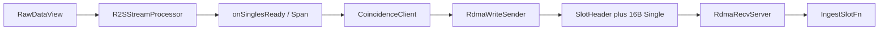

# R2S 到 RDMA

本页只讲数据形态与模块边界。R2S **不直接**调用 RDMA；worker 用回调把 singles 交给 `CoincidenceClient`，再由数据面发出。

## 目的

把一段 `RawDataView` 变成 coin 侧可 ingest 的 16 字节 packed singles 槽。热路径 payload 是连续 `openpni::Single`，不是 protobuf。gRPC 只做控制面（Register / OpenDataPlane / Heartbeat）。

`openpni::Single` 字段见 libpni [CommonDataType](../../../../pni-standard-project/docs/接口说明/core/CommonDataType.md)。本通路要求 `sizeof(Single) == 16` 且 `#pragma pack(1)`。

## 数据流



worker 接线（`app_acq_r2s_node`）：

```cpp
r2sConfig.onSinglesSpanReady = [&coinClient](std::span<const r2s::Single> singles,
                                             uint64_t clockMs, uint32_t durationMs) -> bool {
    return coinClient.sendSingles(singles, clockMs, durationMs);
};
```

## 边界

- **R2S 输出**：host 侧 `vector<Single>` 或回调期内有效的 `span<Single const>`。算法在 libpni `ISingleGenerator` / `ConvergedR2S`；50100 多 GPU 见 [R2S50100MultiGpuEngine](../core/r2s/multi_gpu/R2S50100MultiGpuEngine.md)。
- **打包**：`memcpy` 即可，见 [PackedSingle](../core/streaming/PackedSingle.md)。
- **发送队列**：RoCE 下 `sendSingles` 在调用线程填 TX 槽，sender 只提交 WRITE；InProcess 仍入队后直写环。握手与 PAUSE 见 [状态机与调试.md](../../app以及实验配置/状态机与调试.md)。
- **槽**：64 字节 `SlotHeader` + 连续 16 字节 singles。一块逻辑 chunk 可拆成多 slot，共享 `chunkId`，用 SOF/EOF/PARTIAL 标记。见 [SlotProtocol](../dataplane/rdma/SlotProtocol.md)。
- **传输**：RoCE RC `WRITE_WITH_IMM`；无 verbs 设备或 `forceInProcess` 时走同进程 memcpy。见 [RdmaWriteSender](../dataplane/rdma/RdmaWriteSender.md) / [RdmaRecvServer](../dataplane/rdma/RdmaRecvServer.md)。
- **接收**：`IngestSlotFn` 拿到 `SlotChunkView`；`singlesPacked` 仅在回调返回前有效。

## 拷贝次数

BDM50100 + RoCE、不写盘：raw 2 次（host memcpy + H2D）；singles 为 D2H 再 **一次** 拷进 TX MR，单槽 ingest 再 unpack 一次。跨槽 ingest 一次组装后 move。逐步表与 GPUDirect/采集零拷贝见 [dataplane/rdma/README.md](../dataplane/rdma/README.md)「拷贝与优化」。本页不重复该表。

## 阅读顺序

1. [R2S](../core/r2s/R2S.md) — raw → singles
2. [PackedSingle](../core/streaming/PackedSingle.md) — 布局契约
3. [CoincidenceClient](../grpcService/CoincidenceClient.md) — 发送衔接
4. [SlotProtocol](../dataplane/rdma/SlotProtocol.md) — 槽格式
5. [RdmaWriteSender](../dataplane/rdma/RdmaWriteSender.md) / [RdmaRecvServer](../dataplane/rdma/RdmaRecvServer.md)

跨机实验步骤见 [RDMA多机实验.md](../../app以及实验配置/RDMA多机实验.md)。
