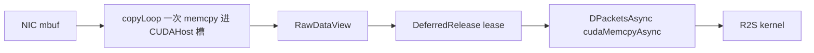

# 采集到 R2S

本页只讲采集缓冲如何变成 GPU 单事件。RDMA 发送见 [R2S到RDMA](R2S到RDMA.md)。

## 目的

实时路径：NIC → DPDKNew CUDAHost 池 → `RawDataView` 租约 → pinned H2D → R2S kernel。本轮不把 kernel 改成读 host 指针，也不做 NIC GPUDirect。

## 数据流

拷贝次数（DPDKNew + 多 GPU 50100，直拷成功时）：

1. CPU：mbuf payload → 定长 pool slot（`storageUnitSize` 对齐，可能带 padding）
2. DMA：payload 跨度 + offset/length/channel → device（`DPacketsAsync`）

不应再出现：mbuf 中转到 localBuffer、pageable 池上的 host bounce。日志应为 `direct pinned H2D`，不是 `pinned bounce`。

## 租约与 Release

- `DistributedAcquisitionNode::SetDeferRawDataRelease(true)`，桥在 R2S 完成后 `Release(view.count)`。
- `completeOldestMultiGpuSegment()` 必须按提交顺序完成。DPDKNew 多 pool 的 `Release(n)` 是 FIFO；乱序归还会还错队列。
- 不要跨两次 `Read()` 继续用上一次 `RawDataView` 指针。

## H2D 规则

- `MakeAcquisitionInfo` 把 `hostMemoryType` 设为 `CUDAHost`（`cudaMallocHost`）。
- `tryRegisterRawViewForH2D`：已是 pinned host 则跳过 `cudaHostRegister`；否则再尝试 register；失败才 bounce。
- 通道过滤若改写了 offset/length/channel，会先拷进 CUDAHost 再提交，避免 pageable `std::vector` 做 DMA 源。

## 后续双机测试（本轮不实现）

已有发包工具 `src/tools/dpdk_tx_replayer_main.cpp`。建议在有网卡与 huge page 的两台机器上分三层：

1. **无 NIC 正确性（可后续进 CI）**：假 `IAcquisitionBase` 喂 CUDAHost `RawDataView`，检查 lease 按序 Release、R2S 走 direct 而非 bounce、`Stop()` 能唤醒阻塞 `Read()`。
2. **双机数据面**：A 机 `dpdk_tx_replayer` 按探测器 IP/端口发包；B 机 `app_acq_r2s_node` + `ALGORITHM_TYPE_DPDK`。断言 `unknown`≈0、`buffer_used` 不顶满、日志为 `direct pinned H2D`、记录 pps / MiB/s。
3. **实时性**：扫 `time_switch_buffer_ms`（建议 20–100ms；节点默认 1000ms 对实时过粗）、`rx_rings_per_port`、`extra_eal_args` 绑核；观察 R2S 排队与 RDMA 是否被采集核抢占。

不接入 `pni-aqst`；本机无设备环境不跑 DPDK。
