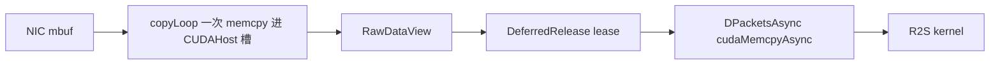

# 采集到 R2S

本页只讲采集缓冲如何变成 GPU 单事件。RDMA 发送见 [R2S到RDMA](R2S到RDMA.md)。

## 目的

实时路径：NIC → DPDKNew CUDAHost 池 → `RawDataView` 租约 → pinned H2D → R2S kernel。本轮不把 kernel 改成读 host 指针，也不做 NIC GPUDirect。

`app_acq_r2s_node` 默认 `source.type=acquisition`：连 `AcquisitionMaster`，Configure/Start 后走 `AcquisitionGrpcNode` → `DistributedAcquisitionNode` → DPDKNew（或 Socket）。`synthetic` / `lsingle_replay` 须显式配置，不经过这条采集环。

## 数据流

```mermaid
flowchart LR
  nic[NIC mbuf]
  copy["copyLoop 一次 memcpy 进 CUDAHost 槽"]
  view[RawDataView]
  lease[DeferredRelease lease]
  h2d["DPacketsAsync cudaMemcpyAsync"]
  gpu[R2S kernel]
  nic --> copy --> view --> lease --> h2d --> gpu
```

拷贝次数（DPDKNew + 多 GPU 50100，直拷成功时）：

1. CPU：mbuf payload → 定长 pool slot（`storageUnitSize` 对齐，可能带 padding）
2. DMA：payload 跨度 + offset/length/channel → device（`DPacketsAsync`）

不应再出现：mbuf 中转到 localBuffer、pageable 池上的 host bounce。日志应为 `direct pinned H2D`，不是 `pinned bounce`。

## 租约与 Release

- `DistributedAcquisitionNode::SetDeferRawDataRelease(true)`，桥在 R2S 完成后 `Release(view.count)`。接线时只建一次 `makeRawDataReleaseFn()`；热路径 `ReleaseRawData` 直接 `algo_->Release`。
- `leaseQueueCapacity` **默认 4**。在途字节约 `lease × 时间片 × 线速`，必须小于采集 `maxBufferSize`（默认 4GiB）。8 卡管线 2 段太浅；再深会超过默认池。不按 GPU 数自动推。
- `completeOldestMultiGpuSegment()` 必须按提交顺序完成。DPDKNew 多 pool 的 `Release(n)` 是 FIFO；乱序归还会还错队列。
- 不要跨两次 `Read()` 继续用上一次 `RawDataView` 指针。

## H2D 规则

- `MakeAcquisitionInfo` 把 `hostMemoryType` 设为 `CUDAHost`（`cudaMallocHost`）。
- `tryRegisterRawViewForH2D`：已是 pinned host 则跳过 `cudaHostRegister`；否则再尝试 register；失败才 bounce。
- 通道过滤若改写了 offset/length/channel，会先拷进 CUDAHost 再提交，避免 pageable `std::vector` 做 DMA 源。

## 本轮采集优化（200 Gib/s 方向）

目标是 NIC → CUDAHost 池，以及现有定长槽 + `DPacketsAsync` 整段 H2D，不被采集侧打穿。不做 GPUDirect，不改 R2S kernel。

已落地：

1. **RSS**：`rx_rings_per_port > 1` 时 `configurePort` 打开 `RTE_ETH_MQ_RX_RSS`，`rss_hf` 与网卡 `flow_type_rss_offloads` 取交（优先 UDP+IP）。协商失败则退回无 RSS，不让 init 硬失败。日志会写 `rss_hf`。
2. **通道哈希**：`toIPMapper` 构建四元组表和 `(dst_ip, dst_port)` 表，热路径 O(1)。未知通道只计数，不再写入池。
3. **写端去锁**：copy burst 用 atomic writer + inflight；`release` 等到 in-flight `write()` 结束。
4. **RX 环**：硬件 RX desc 默认 1024 → 4096（仍经 `rte_eth_dev_adjust_nb_rx_tx_desc` 裁剪）。
5. **时间片**：`timeSwitchBufferMs` / 任务字段为 0 的回退改为 **50ms**。200ms × 25 GiB/s 会超过默认 4 GiB 池。

上机建议（默认 `dpdkRxRingsPerPort` 仍为 1，避免默默多占核）：

- 200 Gib/s：每 100GbE 口约 **4 对 RX/Copy**（8 个 worker lcore），`extra_eal_args` 绑在网卡 NUMA。
- `storageUnitSize` 贴近最大 UDP 载荷；槽比包大时 H2D 会带 padding。
- `timeSwitchBufferMs=50`；`maxBufferSize` 默认 4 GiB 先不动。

## 后续候选（本轮不实现）

按上机结果再选：

- 定长槽 padding：H2D 跨度是 `offset[last]+len-offset[0]`，不是 `Σ length`。可选 host dense pack 或 `DPacketsAsync` 有效字节 gather（会改 offset 约定，需动 R2S 侧）。
- 把 `rxRingSize` / `queueRingSize` 配进 proto。
- copy 侧 `rte_net_get_ptype` / 向量化 `decodeUDP`；非 ARP 队列跳过 ARP 解析。
- 显式 NUMA：mbuf 池、CUDAHost 池、lcore 与网卡同 node 的检查与失败策略。
- 默认 `dpdkRxRingsPerPort` 提到 4（依赖机器核数）。
- 加深 `leaseQueueCapacity` / `computePipelineDepth`（R2S 反压）。

## 双机测试

- **仅采集（已落地，不改生产 app）**：[`tests/performance/dpdk_acq/`](../../../tests/performance/dpdk_acq/README.md)。RX 机精简 `AcquisitionMaster` + `AcquisitionGrpcNode`，TX 机 `tool_dpdk_tx_replayer`。测 NIC→DPDKNew，不跑 R2S/RDMA。930 落盘用测试节点 `--write-raw`，不要临时关掉 worker 后半段。
- **采集→R2S→H2D（仍待做）**：A 机 `dpdk_tx_replayer`；B 机生产 `app_acq_r2s_node` + `ALGORITHM_TYPE_DPDK`。断言 `unknown`≈0、`buffer_used` 不顶满、日志为 `direct pinned H2D`。扫 `time_switch_buffer_ms`（20–100ms，默认 50）与 RSS。不接入 `pni-aqst`；无网卡环境不跑 DPDK。
