# 测试

进程测试源码在 `tests/correctness/`（正确性）与 `tests/performance/`（性能）。产物都在 `bin/test/`。跨机 soak 与剖面判据见 [RDMA多机实验.md](../app以及实验配置/RDMA多机实验.md)，不要和进程测试混用通过标准。

接口与握手以 [接口说明](../接口说明/README.md) 和 [状态机与调试.md](../app以及实验配置/状态机与调试.md) 为准。[STREAMING_COINCIDENCE.md](../STREAMING_COINCIDENCE.md) 是旧综述，热路径已不是 gRPC `StreamSingles`。

## 目录与命名

```text
tests/
  correctness/    # 断言行为是否正确（现有全部用例）
  performance/    # 吞吐/时延/soak
```

可执行文件：`test_<模块>_<描述>`，全小写。模块按被测代码：`r2s` / `rdma` / `coin` / `pni`（OpenPnI 离线脚本）/ `app` / `acq` / `timesync`。共享 helper 不加 `test_` 前缀。

正确性内部仍按 **单元模块 / 通信 / 集成** 说明。性能见 [性能.md](性能.md)。

## 和 app 的关系

| app | 角色 | 进程测试主要覆盖 |
|-----|------|------------------|
| `app_acq_r2s_node` | worker：R2S + `CoincidenceClient` 发送 | synthetic、R2S GPU、RDMA 发送、本机 R2S 发数 |
| `app_coin_master` | 符合-only：RDMA 收 + 对齐 + 符合 | 编排握手、L2 收包、符合 GPU、L3 回放、R2S→coin |

timesync、AcquisitionMaster **现行 app 未接线或会忽略**，对应测试只保模块。

```mermaid
flowchart TB
  subgraph unit [单元模块]
    syn[test_coin_synthetic_singles]
    loop[test_rdma_dataplane_loopback]
    cfg[test_app_config_parse]
    r2sGpu[test_r2s_50100_multi_gpu]
    coinGpu[test_coin_multi_gpu]
    carry[test_coin_carry_boundary]
    shard[test_coin_time_shard]
  end
  subgraph comm [通信]
    orch[test_rdma_orchestration]
    ingress[test_rdma_singles_ingress]
  end
  subgraph integ [集成]
    smoke[test_app_inprocess_smoke]
    r2sGrpc[test_r2s_rdma_send]
    coinStream[test_coin_lsingle_stream]
    r2sCoin[test_r2s_rdma_coin]
  end
  worker[app_acq_r2s_node]
  coin[app_coin_master]
  syn --> worker
  r2sGpu --> worker
  loop --> worker
  cfg --> worker
  cfg --> coin
  orch --> worker
  orch --> coin
  smoke --> worker
  smoke --> coin
  ingress --> coin
  r2sGrpc --> worker
  coinStream --> coin
  r2sCoin --> worker
  r2sCoin --> coin
  coinGpu --> coin
  carry --> coin
```



分类页：[单元模块.md](单元模块.md) · [通信.md](通信.md) · [集成.md](集成.md) · [性能.md](性能.md)

## 测试一览（正确性）

### 单元模块

| 目标 | 用途 |
|------|------|
| `test_coin_synthetic_singles` | 测试 worker synthetic 源的配对公式、分块拼接与时间单调 |
| `test_rdma_dataplane_loopback` | 测试本机 RDMA 槽环写入、credit 与 SOF/EOF 标志是否正确 |
| `test_r2s_50100_multi_gpu` | 测试 50100 单事件转换在多 GPU 上的正确性 |
| `test_coin_multi_gpu` | 测试符合计算在多 GPU 上与单 GPU 结果一致 |
| `test_coin_carry_boundary` | 测试流式分段符合在窗口边界用 carry 能否找回丢失的符合 |
| `test_coin_time_shard` | 测试时间分片双对齐器交接是否与 9120 金标准等价（delay 全等，prompt 遵守 carry 契约） |
| `test_app_config_parse` | 测试 AppConfig 能否解析 example 与 InProcess 冒烟 JSON（有 app 二进制再跑 --dry-run） |
| `test_timesync_algorithm` | 测试多节点时钟漂移校正算法（不走真实 gRPC） |
| `test_pni_r2s_offline` | 用盘上 raw 离线跑 50100 R2S，产出 singles 供对照（非 CI） |
| `test_pni_coin_offline` | 用盘上 singles 离线做符合，检查 prompt/delay 通道分布（非 CI） |

### 通信

| 目标 | 用途 |
|------|------|
| `test_rdma_orchestration` | 测试 worker↔coin 握手、PAUSE、InProcess 发送、通道 remap，以及时间分片冷/热切、租约 FSM 与 Ship |
| `test_rdma_singles_ingress` | 测试 `.lsingle` 经数据面灌入 coin 接收环的连续性与吞吐（不算符合） |
| `test_acq_control_init` | 测试采集 Master 向节点下发任务并进入 CONFIGURED |
| `test_timesync_grpc` | 测试 timesync 的 gRPC 同步、多轮校正与并发客户端 |
| `test_rdma_recv_stub` | 提供不跑符合的 RDMA 接收端，供手工对端联调 |

### 集成

| 目标 | 用途 |
|------|------|
| `test_app_inprocess_smoke` | 测试真实 `app_coin_master` + `app_acq_r2s_node` 的 InProcess synthetic 握手与收发 |
| `test_r2s_rdma_send` | 测试两路 R2S 节点经 RDMA 发到本机接收端（不含符合计算） |
| `test_coin_lsingle_stream` | 测试预计算 singles 灌入真实 coin 后能否产出 prompt/delay |
| `test_r2s_rdma_coin` | 测试本机双 R2S + coin 全链路（R2S → RDMA → 符合） |
| `test_coin_streaming_aligner` | 测试流式时间对齐与符合（不经 RDMA，直接灌 singles） |
| `test_r2s_online_pipeline` | 模拟采集环走完 R2S 与符合并落盘，不做正确性断言 |

## 测试一览（性能）

| 目标 | 用途 |
|------|------|
| `test_r2s_50100_single_ring` | 50100 单环 R2S 吞吐（生产 `processSegment` 多 GPU；预读真实 segment，不扩包） |
| `test_coin_9120_aligner` | 9120 双节点符合吞吐（生产 `StreamingTimeAligner`；预读 `.lsingle`，burst push；事件驱动触发，段大小受 `maxSegmentSingles` 约束） |

## 编译

`./build.sh --tests` 依次 configure+build **core / pni / cuda** 三档，编该档已打开的全部测试（含实验室脚本）。不是扫 `tests/` 目录名。

```bash
cd pni_r2c
./build.sh --tests
# 产物：bin/test/<目标名>
```

分档：

```bash
cmake --preset linux-release-tests-core && cmake --build --preset build-tests-core -j
cmake --preset linux-release-tests-pni  && cmake --build --preset build-tests-pni -j
cmake --preset linux-release-tests-cuda && cmake --build --preset build-tests-cuda -j
```

单项：`cmake --build --preset build-tests-pni -j --target test_coin_synthetic_singles`

## 默认跑测 vs 手工

CTest 标签：`core` / `pni` / `cuda`，外加 `correctness`、`performance`（吞吐，无通过阈值）、`integration`（本机链路、常要数据或 GPU）和 `manual`（实验室脚本 / soak）。默认 CI 仍是 `-LE "integration|manual"`。

```bash
# 推荐 CI：无数据也能过的断言
ctest --test-dir build/tests/core -L core --output-on-failure
ctest --test-dir build/tests/pni  -L pni  -LE "integration|manual" --output-on-failure
ctest --test-dir build/tests/cuda -L cuda -LE "integration|manual" --output-on-failure

# 显式（示例）
ctest --test-dir build/tests/pni -R test_rdma_orchestration --output-on-failure
./bin/test/test_rdma_singles_ingress --data-root /media/lenovo/1TB/50100data/test_9120
```

cuda 档几乎都依赖 9120/校正文件，默认 `-LE integration|manual` 可能没有可跑项。有数据时用 `-L cuda` 或 `-R <名>`。

## 过时与分层（源码保留）

- 已删除的 Makefile 入口：`test-acq-datapath-udp`、`test-acq-r2s-pipeline`、`test-acq-control-smoke`（无对应源文件）。
- `test_rdma_recv_stub`：假 coin 接收端，被 `test_rdma_orchestration` / `test_rdma_singles_ingress` 替代；仍编译，标 `manual`。
- 实验室脚本：`test_pni_r2s_offline`、`test_pni_coin_offline`、`test_r2s_online_pipeline`（无正确性断言）— 照编，默认 ctest 不跑。
- `test_coin_streaming_aligner` 默认只跑 9120 soak（`test7Only`），缺数据或 120s 超时会挂。

## 后续补测（有条件再实现）

本轮只记文档，不写测试代码。

- **B5** 有 9120 `.lsingle` 时：同批 singles 离线符合 vs `CoinGrpcNode` 写出的 LMF 条数（允许窗边界阈值）。挂 cuda 档，标 `integration`。
- **B6** worker `source.type=lsingle_replay`（`sendReplayBySegment`）小 fixture，与 L2 `lsingle_replay` helper 对齐。缺数据 skip。
- **C7** 本机有 verbs 时：`CoincidenceClient::sendSingles(span)` 走 RoCE 回调填 TX，挂现有 `testSameProcessRoce` 的 skip 逻辑；无 RNIC 不算失败。
